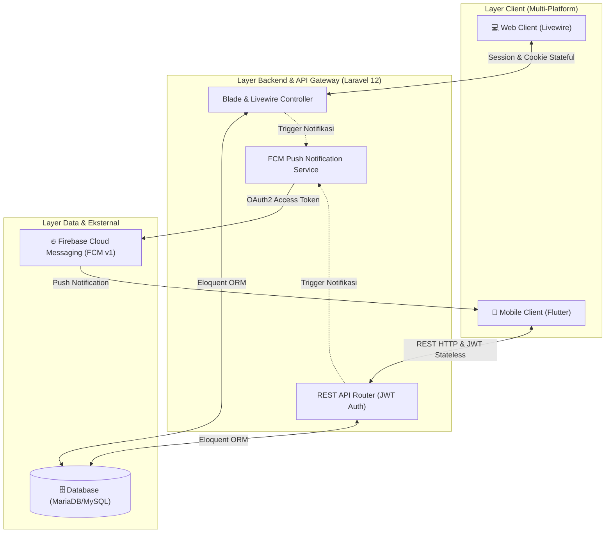
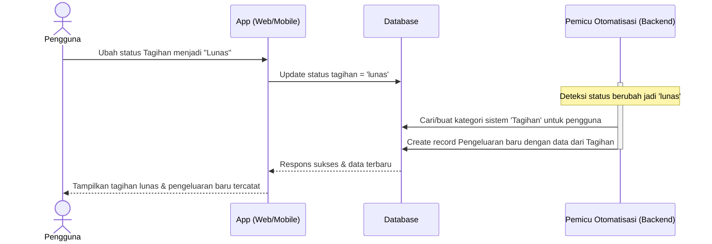
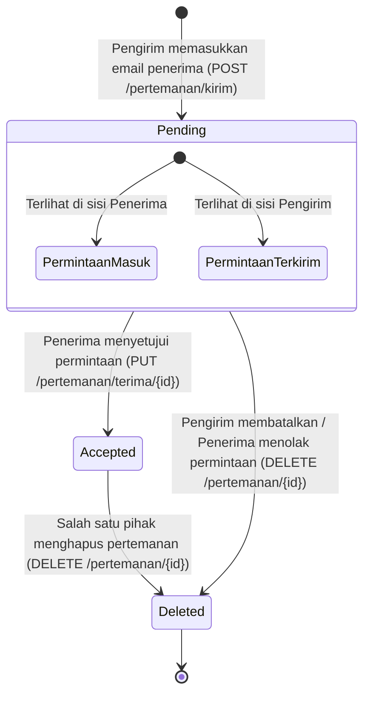
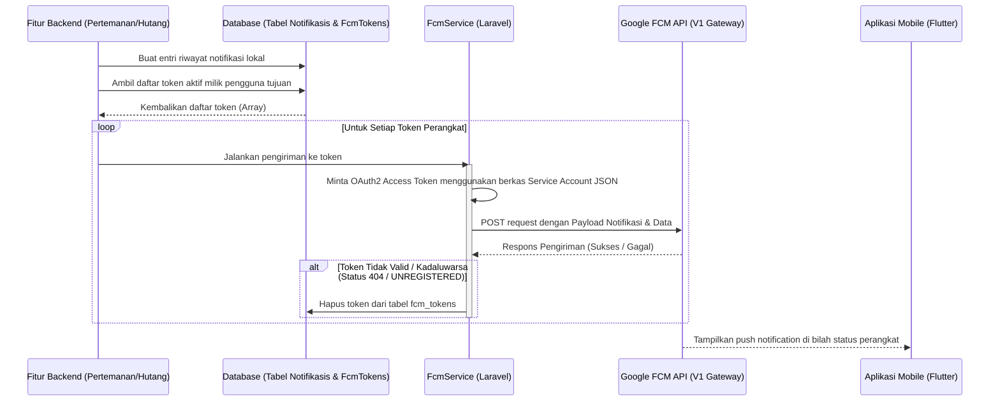

# 📘 BUKU PANDUAN: INTEGRASI SISTEM & IMPLEMENTASI FITUR
## Sistem Aplikasi Pengelolaan Keuangan "Kelola Uang" (Kepitink)
*Panduan Arsitektur, Alur Kerja, dan Integrasi Multi-Platform (Web & Mobile)*

---

## 📋 DAFTAR ISI

1. [Bab 1: Arsitektur Sistem Terintegrasi](#bab-1-arsitektur-sistem-terintegrasi)
2. [Bab 2: Manajemen Otentikasi dan Pengguna](#bab-2-manajemen-otentikasi-dan-pengguna)
3. [Bab 3: Implementasi Fitur Keuangan Inti](#bab-3-implementasi-fitur-keuangan-inti)
4. [Bab 4: Sistem Pertemanan dan Kolaborasi Hutang](#bab-4-sistem-pertemanan-dan-kolaborasi-hutang)
5. [Bab 5: Mekanisme Push Notification & Firebase Cloud Messaging (FCM)](#bab-5-mekanisme-push-notification--firebase-cloud-messaging-fcm)
6. [Bab 6: Pedoman Pengujian dan Pemeliharaan Sistem](#bab-6-pedoman-pengujian-dan-pemeliharaan-sistem)

---

## Bab 1: Arsitektur Sistem Terintegrasi

Sistem Kelola Uang (Kepitink) dirancang menggunakan pendekatan **Hybrid Monolithic Architecture**. Struktur ini memanfaatkan satu buah basis data (Shared Database) dan satu backend terpusat (Laravel 12) untuk melayani dua jenis platform client yang berbeda secara bersamaan:

1. **Web Client**: Dibangun menggunakan **Laravel Livewire (Volt / Standard)** yang berjalan secara server-side rendered. Perubahan UI diperbarui secara reaktif menggunakan komunikasi AJAX/Websocket di balik layar tanpa perlu mereload seluruh halaman.
2. **Mobile Client**: Dibangun menggunakan **Flutter**, beroperasi sebagai aplikasi client-side rendered mandiri yang berkomunikasi dengan backend melalui **RESTful API** berbasis format pertukaran data JSON.

### 🌐 Diagram Alur Integrasi Sistem

Berikut adalah visualisasi bagaimana Web Client dan Mobile Client terintegrasi dalam satu ekosistem backend:



### 🗄️ Konsep Shared Database (Basis Data Bersama)
Kedua platform (Web dan Mobile) menggunakan tabel basis data yang sama. Hal ini memberikan beberapa keuntungan penting:
* **Konsistensi Data Instan**: Setiap transaksi pemasukan, pengeluaran, tagihan, atau pertemanan yang ditambahkan melalui aplikasi Flutter akan langsung terlihat di dashboard Web secara *real-time* saat halaman diakses, dan sebaliknya.
* **Redundansi Kode Minimal**: Logika bisnis (seperti perhitungan sisa anggaran atau validasi data pertemanan) ditulis sekali di backend Laravel dan digunakan bersama oleh kedua interface.

---

## Bab 2: Manajemen Otentikasi dan Pengguna

Keamanan akun dan pembatasan hak akses data dikelola melalui dua metode otentikasi yang disesuaikan dengan karakteristik masing-masing platform.

### 🔐 1. Otentikasi Stateful (Web Client)
* **Mekanisme**: Web client menggunakan Laravel Session dan Cookie bawaan. Saat pengguna mengisi form login di web, Laravel membuat sesi unik di server dan mengirimkan ID Sesi (Session ID) ke browser pengguna melalui cookie terenkripsi yang aman.
* **Perlindungan**: Dilengkapi dengan sistem proteksi **CSRF (Cross-Site Request Forgery)** pada setiap form web atau aksi Livewire untuk mencegah eksekusi aksi ilegal dari luar aplikasi.

### 🔑 2. Otentikasi Stateless JWT (Mobile Client)
Aplikasi mobile (Flutter) menggunakan otentikasi tanpa status (stateless) berbasis **JSON Web Token (JWT)** yang dikelola oleh library `tymon/jwt-auth`.

* **Alur Login**:
  1. Aplikasi Flutter mengirim email dan password ke `/api/auth/login`.
  2. Backend memvalidasi kredensial. Jika valid, backend merespons dengan string token JWT terenkripsi.
  3. Flutter menyimpan token ini secara lokal di media penyimpanan aman perangkat (**SharedPreferences** atau **Flutter Secure Storage**).
* **Penggunaan Token**: Untuk semua request API yang memerlukan otentikasi, Flutter harus menyertakan token ini pada header HTTP request:
  ```http
  Authorization: Bearer <your_jwt_token>
  ```
* **Masa Berlaku & Refresh**: Token memiliki masa aktif terbatas untuk alasan keamanan. Flutter dapat meminta token baru menggunakan endpoint `/api/auth/refresh` tanpa memaksa pengguna mengetik ulang email dan password mereka.

### 🌐 3. Integrasi Pihak Ketiga: Google OAuth
Untuk mempermudah pengguna, sistem mendukung login cepat menggunakan akun Google.
* **Web**: Menggunakan tombol "Sign-In with Google" yang memanfaatkan Laravel Socialite. Setelah berhasil di-redirect dari Google, backend mencocokkan `google_id` atau email pengguna untuk login otomatis ke sesi web.
* **Mobile**: Flutter menggunakan library `google_sign_in` untuk mendapatkan otentikasi Google secara native di perangkat mobile, lalu mengirim token tersebut ke backend untuk diverifikasi dan ditukarkan dengan token JWT lokal.

---

## Bab 3: Implementasi Fitur Keuangan Inti

Fitur keuangan dirancang untuk mempermudah pencatatan, pemantauan batas anggaran, dan otomatisasi administrasi tagihan berkala.

### 💰 1. Arus Pencatatan Keuangan: Pemasukan & Pengeluaran
Setiap transaksi keuangan direkam dengan data terperinci seperti tanggal, nominal, deskripsi, metode pembayaran (Qris, Bank, Dana, Gopay, Cash), serta relasi kategori. 
* **Web**: Pencatatan dilakukan melalui formulir modal interaktif Livewire yang secara dinamis memperbarui tabel transaksi dan grafik dashboard.
* **Mobile**: Flutter menggunakan model data Dart untuk mengonversi form UI menjadi JSON payload untuk dikirim ke API POST `/api/pemasukan` atau `/api/pengeluaran`.

### 💵 2. Batas Harian (Daily Budget Limit)
Batas Harian adalah fitur pengendali pengeluaran di mana pengguna dapat menentukan batas maksimal pengeluaran mereka per hari.
* **Logika Perhitungan**:
  Setiap kali dashboard dimuat, sistem akan menjalankan kueri agregasi untuk menjumlahkan seluruh transaksi pengeluaran pengguna pada hari yang bersangkutan (menggunakan filter tanggal hari ini).
* **Rumus Sisa Anggaran**:
  $$\text{Sisa Anggaran} = \text{Batas Harian} - \sum(\text{Total Pengeluaran Hari Ini})$$
* **Visualisasi Presentase**:
  Presentase batas harian dihitung menggunakan rumus:
  $$\text{Persentase Terpakai} = \min\left(\left(\frac{\text{Total Pengeluaran Hari Ini}}{\text{Batas Harian}}\right) \times 100,\ 100\right)$$
  Angka ini ditampilkan dalam bentuk diagram lingkaran progresif (progress ring) di web dan mobile. Jika pengeluaran hari ini telah melampaui batas harian, indikator visual akan berubah warna menjadi merah sebagai peringatan bagi pengguna.

### 📄 3. Otomatisasi Tagihan ke Pengeluaran (Bill Automation)
Salah satu fitur integrasi pintar dalam sistem ini adalah penggabungan data antara **Tagihan (Bills)** dan **Pengeluaran (Expense)**.



* **Bagaimana Mekanismenya Bekerja?**
  Ketika pengguna membuat tagihan baru (misal: "Tagihan Listrik" Rp500.000) dengan status `belum_dibayar`, transaksi ini hanya terdaftar sebagai tagihan masa depan. Namun, saat pengguna melakukan pembayaran dan memperbarui status tagihan menjadi `lunas` (baik melalui klik tombol di halaman web Livewire atau via API PUT `/api/tagihan/{id}` dari Flutter), backend Laravel akan secara otomatis memicu pembuatan baris baru di tabel `pengeluarans`.
* **Rincian Data Pengeluaran Otomatis**:
  * **Kategori**: Sistem mencari kategori pengeluaran bernama "Tagihan" milik pengguna. Jika belum ada, sistem akan membuatnya secara otomatis (`firstOrCreate`).
  * **Total**: Nominal diambil dari jumlah tagihan yang dilunasi.
  * **Tujuan**: Diisi dengan nama tagihan (misal: "Tagihan Listrik").
  * **Metode Pembayaran**: Diambil sesuai metode pembayaran yang dipilih saat pelunasan tagihan.
  * **Tanggal**: Tanggal pengeluaran di-set otomatis menjadi tanggal hari pelunasan tersebut dilakukan.

---

## Bab 4: Sistem Pertemanan dan Kolaborasi Hutang

Sistem ini mendukung fitur sosial sederhana yang memungkinkan kolaborasi pencatatan transaksi hutang piutang antar pengguna aplikasi.

### 👥 1. Alur Manajemen Pertemanan
Pertemanan merupakan jembatan relasi sebelum pengguna dapat berkolaborasi dalam pencatatan hutang. Relasi ini disimpan pada tabel `pertemanans`.

* **Mesin Status Pertemanan (State Machine)**:



* **Pencarian Pengguna**: Fitur cari pengguna menggunakan kueri pencarian parsial berdasarkan email. Untuk menjaga privasi dan kebersihan relasi, pengguna tidak dapat mencari dirinya sendiri, dan sistem akan menginformasikan status hubungan saat ini (apakah sudah berteman, pending, atau belum ada relasi).

### 💳 2. Kolaborasi Pencatatan Hutang (Hutang Saya vs Hutang Teman)
Fitur hutang terintegrasi secara langsung dengan sistem pertemanan yang berstatus aktif (`accepted`).

* **Pencatatan Mandiri (Tanpa Teman Terdaftar)**: Pengguna dapat mencatat hutang secara manual dengan mengetik nama kontak biasa (misal: "Toko Kelontong Pak Asep"). Data ini bersifat privat dan hanya dapat dilihat oleh pengguna yang mencatat.
* **Pencatatan Kolaboratif (Dengan Teman Terdaftar)**:
  * Jika kolom `id_teman` diisi dengan ID teman yang sah dan aktif, sistem akan menghubungkan catatan hutang tersebut kepada kedua pengguna.
  * Pengguna yang mencatat hutang tersebut akan melihat transaksi ini sebagai **Hutang yang Dicatat** (berfungsi sebagai piutang/pemberi pinjaman).
  * Teman yang ditunjuk sebagai peminjam akan secara otomatis melihat transaksi ini di aplikasi mereka pada halaman **"Hutang Saya"** (diambil melalui API `/api/hutang/hutang-saya`).
  * Hal ini meminimalkan perselisihan pencatatan karena kedua belah pihak melihat angka dan catatan nominal yang sama persis dari satu sumber data tunggal.

---

## Bab 5: Mekanisme Push Notification & Firebase Cloud Messaging (FCM)

Sistem notifikasi dirancang untuk memberi tahu pengguna secara *real-time* mengenai aktivitas penting, seperti permintaan pertemanan baru, penerimaan pertemanan, dan pencatatan atau pembaruan status hutang.

### 📱 1. Alur Registrasi Perangkat (FCM Token)
Untuk mengirim pesan ke perangkat mobile spesifik, backend memerlukan token identitas unik perangkat dari Firebase.
1. Saat aplikasi Flutter dijalankan pertama kali atau setelah user berhasil masuk (login), aplikasi meminta token perangkat dari SDK Firebase.
2. Flutter mengirim token tersebut ke backend via API POST `/api/fcm-token`.
3. Backend menyimpan token tersebut di tabel `fcm_tokens` yang berelasi dengan `id_user`. Satu pengguna dapat memiliki lebih dari satu token jika mereka login di beberapa perangkat berbeda (misalnya: tablet dan ponsel).
4. Saat pengguna melakukan logout, aplikasi Flutter memanggil API DELETE `/api/fcm-token` untuk menghapus token perangkat dari server agar perangkat tersebut berhenti menerima notifikasi.

### ⚙️ 2. Alur Pengiriman Push Notification dari Backend



* **Manajemen Token Rusak (Self-Cleaning Tokens)**:
  Dalam `FcmService`, jika API Google FCM merespons dengan kesalahan `UNREGISTERED` atau status `NOT_FOUND` (yang menunjukkan aplikasi telah di-uninstall atau token sudah tidak valid), Laravel akan secara otomatis menghapus token bermasalah tersebut dari database. Mekanisme ini menjaga agar tabel token tetap bersih dan menghemat sumber daya sistem pada pengiriman notifikasi berikutnya.

### 🛠️ 3. Penanganan Notifikasi di Sisi Flutter
Aplikasi Flutter harus menangani pesan masuk tergantung pada status aplikasi saat notifikasi diterima:

| Status Aplikasi | Cara Menangani Notifikasi | Penampilan Visual |
| :--- | :--- | :--- |
| **Foreground** (Aplikasi sedang aktif dibuka layar) | Ditangkap oleh pendengar event `FirebaseMessaging.onMessage`. Flutter akan membuat banner notifikasi lokal secara manual menggunakan library `flutter_local_notifications`. | Banner HUD mengambang di atas layar aplikasi |
| **Background** (Aplikasi berjalan di latar belakang) | Ditangani langsung oleh sistem operasi ponsel. Ketika notifikasi di-tap oleh pengguna, sistem memicu method `FirebaseMessaging.onMessageOpenedApp` untuk mengarahkan pengguna ke halaman yang sesuai. | Notifikasi muncul di laci pemberitahuan sistem operasi |
| **Terminated** (Aplikasi tertutup sepenuhnya / mati) | Ketika pengguna menekan notifikasi saat aplikasi mati, sistem operasi akan meluncurkan aplikasi dan mengirim payload melalui method `FirebaseMessaging.instance.getInitialMessage()`. | Peluncuran aplikasi disusul langsung ke halaman tujuan notifikasi |

---

## Bab 6: Pedoman Pengujian dan Pemeliharaan Sistem

Untuk memastikan kelangsungan hidup aplikasi dan kelancaran proses integrasi, tim pengembang disarankan untuk mengikuti protokol pengujian berikut.

### 🧪 1. Otomatisasi Pengujian (Backend Laravel)
Seluruh fungsionalitas API dan integrasi sistem wajib diverifikasi menggunakan rangkaian pengujian otomatis.
* **Pest PHP**: Proyek ini menggunakan Pest untuk pengujian fungsionalitas API. Setiap modul (seperti registrasi FCM token, pembuatan hutang, dan pertemanan) memiliki file uji masing-masing di folder `tests/Feature/`.
* **Perintah Uji**: Untuk menjalankan semua pengujian API secara cepat dan ringkas, gunakan perintah:
  ```bash
  php artisan test --compact
  ```
* **Penggunaan Factory**: Selalu gunakan model factory bawaan Laravel untuk memicu data buatan dalam skenario pengujian, hindari pengisian data secara manual di dalam method tes.

### 📡 2. Pengujian Manual API (Postman)
Untuk pengembang mobile, repositori ini menyediakan koleksi Postman yang terletak pada folder `docs/postman/kelola_uang_api.postman_collection.json`.
* **Langkah Uji**:
  1. Impor berkas koleksi JSON tersebut ke aplikasi Postman.
  2. Atur variabel lingkungan `base_url` ke alamat server lokal Anda (misalnya `http://127.0.0.1:8000/api`).
  3. Jalankan pengujian berurutan mulai dari pembuatan akun (Register), masuk akun (Login) untuk mendapatkan token, dan uji endpoint fitur lainnya dengan menyertakan token di bagian otentikasi.

### 🧹 3. Rekomendasi Pemeliharaan Rutin
* **Pembersihan Log**: Jalankan perintah `composer run dev` atau pembersihan cache konfigurasi Laravel secara berkala jika ada perubahan variabel lingkungan `.env`.
* **Perapian Kode**: Sebelum melakukan commit ke repositori Git, jalankan linter bawaan proyek untuk merapikan gaya penulisan kode PHP Anda agar seragam dengan standar tim:
  ```bash
  vendor/bin/pint --dirty --format agent
  ```

---

> [!NOTE]  
> Buku panduan ini diperbarui secara berkala mengikuti perkembangan arsitektur sistem. Untuk kendala integrasi atau pertanyaan teknis lebih lanjut, hubungi koordinator tim backend atau baca dokumentasi endpoint lengkap pada direktori `docs/docs/flutter/01_API_ENDPOINTS.md`.
