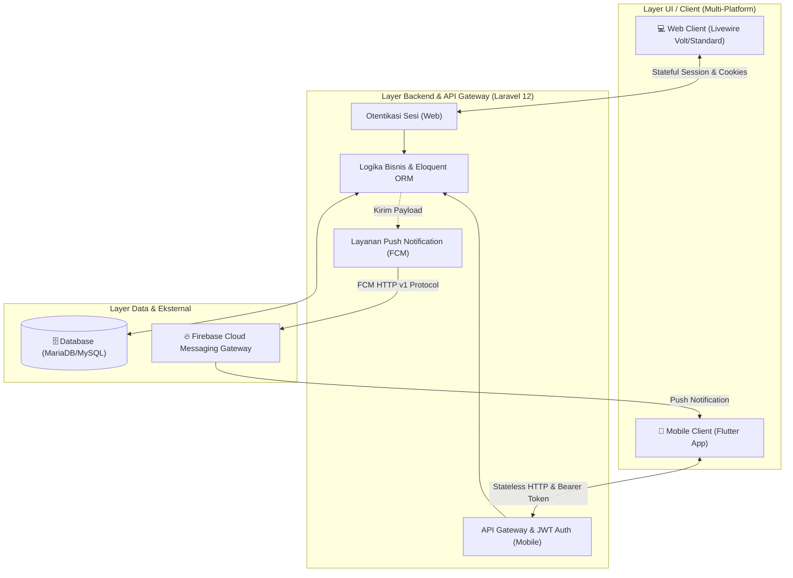
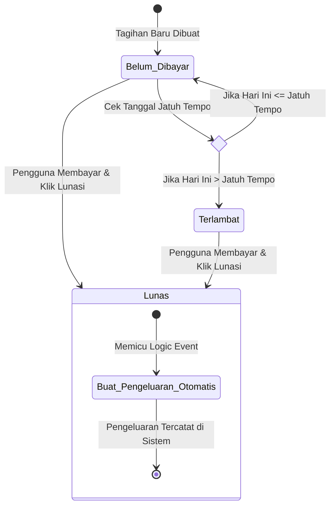
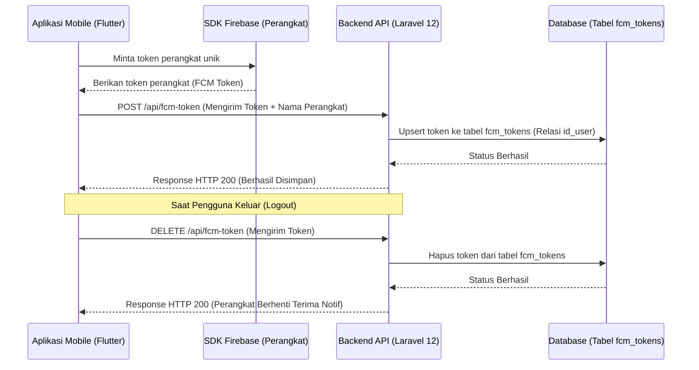

# 📘 BUKU PANDUAN UTAMA: DOKUMENTASI SISTEM TERPADU (KELOLA UANG)
*Panduan Komprehensif: Deskripsi Aplikasi, Desain Sistem, Implementasi Fitur, dan Integrasi Multi-Platform*

---

## 📋 DAFTAR ISI

1. [Bab 1: Deskripsi Aplikasi](#bab-1-deskripsi-aplikasi)
2. [Bab 2: Desain Sistem & Arsitektur](#bab-2-desain-sistem--arsitektur)
3. [Bab 3: Implementasi Fitur Aplikasi](#bab-3-implementasi-fitur-aplikasi)
4. [Bab 4: Integrasi Sistem Multi-Platform](#bab-4-integrasi-sistem-multi-platform)

---

## Bab 1: Deskripsi Aplikasi

### 1.1 Latar Belakang & Tujuan
**Kelola Uang** (dikenal secara internal sebagai **Kepitink**) adalah platform manajemen keuangan pribadi dan sosial yang dirancang untuk membantu pengguna melacak aliran kas, mengendalikan pengeluaran harian, mengelola tagihan rutin, serta berkolaborasi dalam pencatatan hutang piutang secara terintegrasi.

Aplikasi ini mengatasi dua masalah utama dalam pengelolaan keuangan personal:
1. **Kurangnya Kontrol Pengeluaran Harian**: Sering kali pengguna tidak menyadari bahwa mereka telah menghabiskan anggaran melebihi batas kemampuan mereka sebelum akhir bulan.
2. **Ketidakselarasan Catatan Hutang**: Pencatatan hutang secara manual sering kali menimbulkan perselisihan akibat perbedaan catatan nominal antara pemberi pinjaman dan peminjam.

Dengan menghadirkan integrasi lintas platform antara aplikasi **Web** dan aplikasi **Mobile**, Kelola Uang memberikan aksesibilitas yang fleksibel bagi pengguna untuk mencatat transaksi kapan saja dan di mana saja.

### 🎯 1.2 Nilai Tambah & Fitur Utama
Sistem ini menyediakan serangkaian fitur utama yang saling terhubung:
* **Dashboard Finansial Terpadu**: Menyajikan ringkasan total saldo, pemasukan, pengeluaran, serta grafik analisis pengeluaran berbasis kategori secara interaktif.
* **Manajemen Transaksi Dinamis**: Memungkinkan pencatatan pemasukan dan pengeluaran secara rinci dengan kustomisasi kategori menggunakan emoji dan kode warna.
* **Batas Harian (Daily Limit)**: Sistem pengendali anggaran yang membatasi pengeluaran harian pengguna dan memberikan peringatan visual jika batas terlampaui.
* **Asisten Tagihan Berkala**: Melacak tagihan rutin (listrik, internet, sewa, dll.) dengan sistem pengingat jatuh tempo serta otomatisasi pencatatan pengeluaran saat tagihan dilunasi.
* **Pertemanan & Hutang Kolaboratif**: Menghubungkan pengguna dengan teman terdaftar untuk mencatat hutang secara transparan di mana kedua belah pihak dapat melihat data yang sama secara *real-time*.
* **Notifikasi Instan (Push Notification)**: Mengirimkan pemberitahuan push langsung ke ponsel pengguna ketika terjadi interaksi pertemanan atau perubahan status hutang.

---

## Bab 2: Desain Sistem & Arsitektur

Sistem ini didesain menggunakan pola **Hybrid Monolithic Architecture** dengan satu basis data tunggal (*shared database*) untuk menjamin konsistensi informasi yang diakses melalui Web (Laravel Livewire) maupun Mobile (Flutter).

### 🌐 2.1 Arsitektur Komunikasi Sistem
Berikut adalah visualisasi bagaimana Web Client dan Mobile Client terintegrasi dalam satu ekosistem backend:

### 🗄️ 2.2 Desain Database & Skema Relasi (Entity Relationship)
Seluruh data disimpan pada basis data relasional. Berikut adalah tabel-tabel utama beserta fungsinya:

```mermaid
erDiagram
    USERS ||--o{ PEMASUKANS : "mencatat"
    USERS ||--o{ PENGELUARANS : "mencatat"
    USERS ||--o{ TAGIHANS : "memiliki"
    USERS ||--o{ BATAS_HARIANS : "mengatur"
    USERS ||--o{ HUTANGS : "mempunyai"
    USERS ||--o{ PERTEMANANS : "mengirim/menerima"
    USERS ||--o{ FCM_TOKENS : "mendaftarkan"
    USERS ||--o{ NOTIFIKASIS : "menerima"
    
    KATEGORIS ||--o{ PENGELUARANS : "mengklasifikasikan"
    KATEGORI_TAGIHANS ||--o{ TAGIHANS : "mengklasifikasikan"

    USERS {
        bigint id PK
        string name
        string email
        string password
        string google_id
    }
    
    PEMASUKANS {
        bigint id PK
        bigint id_user FK
        string jenis
        double total
        date tanggal
        text description
    }

    PENGELUARANS {
        bigint id PK
        bigint id_user FK
        bigint id_kategori FK
        double total
        date tanggal_pengeluaran
        string status
        string metode_pembayaran
        text description
        string tujuan
    }

    TAGIHANS {
        bigint id PK
        bigint id_user FK
        bigint kategori FK "Kategori Tagihan"
        string nama
        double nominal
        datetime jatuh_tempo
        string status "belum_dibayar | lunas | terlambat"
        string metode_pembayaran
        string pengulangan "sekali_bayar | bulanan | tahunan"
        text catatan
    }

    BATAS_HARIANS {
        bigint id PK
        bigint id_user FK
        double batas
    }

    HUTANGS {
        bigint id PK
        bigint id_user FK "Pemberi Pinjaman"
        bigint id_teman FK "Peminjam (User Terdaftar)"
        string nama "Nama Kontak Manual jika bukan teman"
        double jumlah
        date tanggal_pinjaman
        string metode_pembayaran
        string status "belum_lunas | lunas | terlambat"
        text catatan
    }

    PERTEMANANS {
        bigint id PK
        bigint id_user FK "Pengirim Permintaan"
        bigint id_teman FK "Penerima Permintaan"
        string status "pending | accepted"
    }

    FCM_TOKENS {
        bigint id PK
        bigint id_user FK
        string token
        string device_name
    }

    NOTIFIKASIS {
        bigint id PK
        bigint id_user FK
        string judul
        string pesan
        string tipe "pertemanan | hutang | sistem"
        json data "Payload detail id relasi"
        datetime dibaca_at
    }
```

---

## Bab 3: Implementasi Fitur Aplikasi

Sistem mengimplementasikan logika bisnis keuangan secara konsisten baik di web maupun mobile. Bagian ini menjelaskan mekanisme kerja di balik layar untuk fitur-fitur tersebut.

### 💰 3.1 Pencatatan Transaksi & Manajemen Kategori
Sistem membagi arus keuangan menjadi dua entitas terpisah: `Pemasukan` (kas masuk) dan `Pengeluaran` (kas keluar).
* **Kategori Dinamis**: Pengeluaran diklasifikasikan ke dalam kategori yang dibuat sendiri oleh pengguna. Kategori ini dilengkapi kolom `emoji` dan `warna` (Hex Code) untuk mempermudah identifikasi visual pada visualisasi grafik chart di halaman Dashboard.
* **Metode Pembayaran**: Pengguna dapat memilih metode pembayaran (Qris, Bank, Dana, Gopay, Cash) pada saat mencatat pengeluaran guna melacak dari mana uang fisik mereka keluar.

### 💵 3.2 Mesin Pengendali Batas Harian (Daily Limit Engine)
Fitur ini bekerja sebagai monitor *real-time* pengeluaran harian pengguna.
* **Pengambilan Data**: Sistem menjumlahkan nominal transaksi pengeluaran pengguna khusus pada hari ini:
  $$\text{Total Pengeluaran Hari Ini} = \sum(\text{Nominal Pengeluaran tanggal hari ini})$$
* **Sisa Batas Harian**: Dihitung secara dinamis dengan mengurangi Batas Harian yang diatur pengguna dengan total pengeluaran mereka hari ini.
* **Respons Sistem**:
  * **Web (Livewire)**: Properti dihitung ulang setiap kali komponen Dashboard di-render (`mount()` dan `render()`). Jika nominal terpakai melebihi batas, CSS Tailwind akan menampilkan indikator waspada berwarna merah secara instan.
  * **Mobile (Flutter)**: Mengonsumsi data agregasi ini dari endpoint `/api/dashboard` yang memproses perhitungan di server agar kinerja pemrosesan di ponsel tetap ringan.

### 📄 3.3 Otomatisasi Siklus Tagihan
Fitur ini mengintegrasikan kewajiban pembayaran (Tagihan) dengan riwayat belanja (Pengeluaran).

* **Pengecekan Jatuh Tempo Otomatis**: Saat daftar tagihan dimuat, sistem membandingkan waktu saat ini dengan kolom `jatuh_tempo`. Jika batas waktu telah terlewati dan status masih `belum_dibayar`, sistem secara otomatis memperbarui status tampilan menjadi `terlambat`.
* **Otomatisasi Catatan Pengeluaran**:
  Apabila pengguna mengubah status tagihan menjadi `lunas`, sistem secara otomatis membuat catatan pengeluaran baru dengan nominal sesuai tagihan tersebut. Kategori pengeluaran akan diarahkan ke kategori bernama "Tagihan" (dibuat otomatis oleh sistem jika belum ada), sehingga pengguna tidak perlu menulis ulang pengeluaran secara manual setelah melunasi tagihannya.

---

## Bab 4: Integrasi Sistem Multi-Platform

Integrasi multi-platform memastikan kelancaran alur kerja, keamanan otentikasi, sinkronisasi data instan, dan distribusi notifikasi antar perangkat.

### 🔐 4.1 Otentikasi Terpadu: Sesi Web vs API Token JWT
Meskipun Web dan Mobile menggunakan metode otentikasi berbeda (Stateful Session untuk Web, Stateless JWT untuk Mobile), keduanya merujuk pada baris pengguna yang sama di dalam tabel `users`.
* **Keamanan Mobile**: Token JWT dikirim di setiap request API. Token divalidasi oleh middleware Laravel sebelum memberikan akses ke data keuangan pengguna.
* **Integrasi Lintas Platform**: Pengguna dapat mendaftar melalui aplikasi mobile, lalu masuk ke versi web menggunakan kredensial yang sama, dan sebaliknya. Seluruh data keuangan akan tersinkronisasi tanpa kendala karena terikat pada `id_user` yang sama di database.

### 👥 4.2 Integrasi Sosial: Hubungan Pertemanan & Hutang Kolaboratif
Fitur pertemanan dirancang untuk mendukung pencatatan hutang piutang antar pengguna aplikasi secara aman dan transparan.
* **Pencarian Pengguna**: Dilakukan berdasarkan alamat email yang tepat untuk menghindari salah tambah teman.
* **Validasi Pertemanan pada Hutang**: Saat pengguna mencatat hutang dengan memilih opsi teman terdaftar (`id_teman`), backend Laravel akan memeriksa apakah relasi pertemanan mereka berstatus `accepted` (diterima). Jika tidak, transaksi akan ditolak demi menjaga integritas data.
* **Dua Sisi Pencatatan**:
  * Ketika Pengguna A mencatat bahwa Pengguna B berhutang kepadanya sebesar Rp50.000, Pengguna A akan melihatnya sebagai piutang (uang yang akan masuk).
  * Di saat yang sama, sistem menampilkan catatan ini di aplikasi Pengguna B sebagai **Hutang Saya** (kewajiban bayar) melalui endpoint khusus `/api/hutang/hutang-saya`. Kedua pengguna melihat nominal, tanggal, dan catatan yang sama.

### 🔔 4.3 Arsitektur Push Notification Real-Time (FCM v1)
Sistem notifikasi menggunakan layanan **Firebase Cloud Messaging (FCM)** generasi terbaru (HTTP v1 API) yang terintegrasi dengan kredensial Google Service Account di Laravel backend.

* **Siklus Token Perangkat (Device Token Lifecycle)**:

* **Alur Trigger Notifikasi**:
  1. Pengguna A mengirim permintaan pertemanan ke Pengguna B.
  2. Backend menyimpan relasi pertemanan baru dengan status `pending` di database.
  3. Backend memanggil kelas `FcmService` untuk mengirim push notification ke semua token perangkat aktif milik Pengguna B yang terdaftar di database.
  4. `FcmService` meminta OAuth2 Access Token dari Google API menggunakan file konfigurasi JSON Service Account.
  5. Backend mengirimkan request HTTP POST yang berisi payload notifikasi ke Gateway Google FCM.
  6. Google FCM menyebarkan notifikasi tersebut ke ponsel Pengguna B secara *real-time*.
  7. Apabila Google FCM mengembalikan respons error bahwa token telah kadaluwarsa (misalnya karena aplikasi telah di-uninstall), backend Laravel akan menghapus token tersebut dari database demi menghemat memori.

---

> [!IMPORTANT]  
> Seluruh implementasi fitur dan integrasi multi-platform ini dibangun dengan mematuhi standar keamanan modern. Untuk detail teknis mengenai daftar lengkap endpoint API, silakan merujuk pada berkas dokumentasi pengembang di [API_ENDPOINTS.md](file:///c:/Users/ervan/Herd/kelola_uang/docs/docs/flutter/01_API_ENDPOINTS.md).
