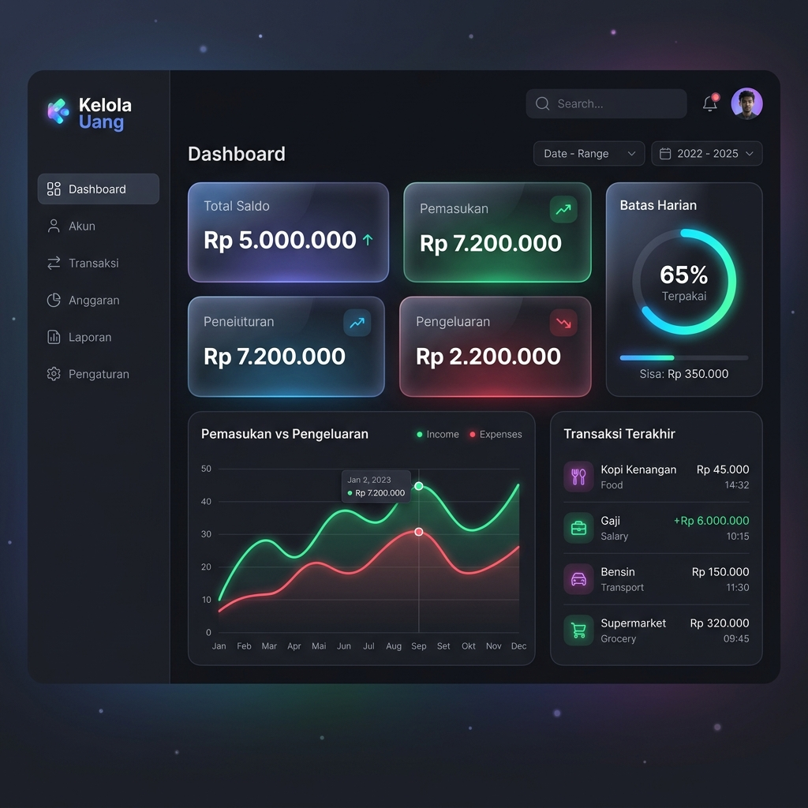
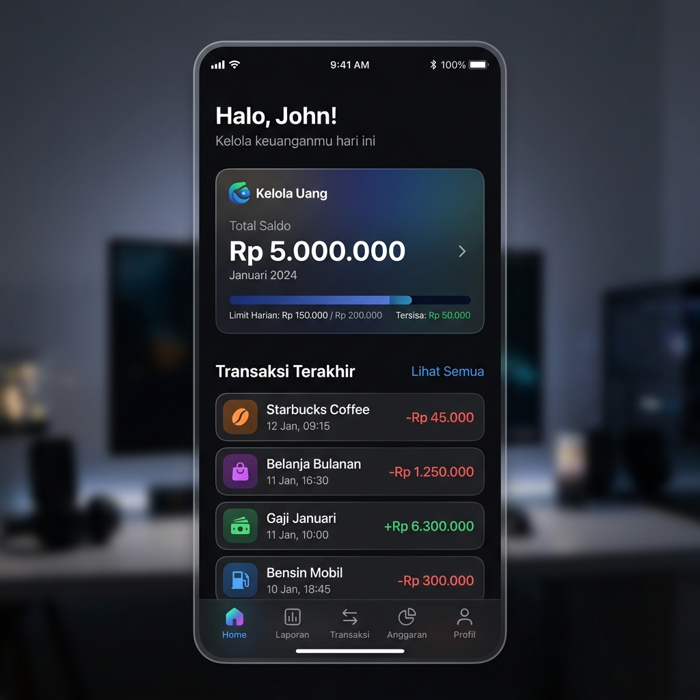

# 📘 TUTORIAL STEP-BY-STEP: IMPLEMENTASI FITUR KELOLA UANG
*Panduan Praktis Pengembangan, Contoh Kode Kunci, Alur Pemrosesan, dan Tampilan Antarmuka untuk Versi Web (Livewire) & Mobile (Flutter)*

---

## 📋 DAFTAR ISI

1. [Bab 1: Tutorial Implementasi Otomatisasi Tagihan Ke Pengeluaran](#bab-1-tutorial-implementasi-otomatisasi-tagihan-ke-pengeluaran)
2. [Bab 2: Tutorial Implementasi Pengendali Batas Harian (Daily Budget Limit)](#bab-2-tutorial-implementasi-pengendali-batas-harian-daily-budget-limit)
3. [Bab 3: Tutorial Implementasi Kolaborasi Hutang Lintas Pengguna](#bab-3-tutorial-implementasi-kolaborasi-hutang-lintas-pengguna)
4. [Bab 4: Tutorial Implementasi Push Notification Real-Time (FCM v1)](#bab-4-tutorial-implementasi-push-notification-real-time-fcm-v1)

---

## Bab 1: Tutorial Implementasi Otomatisasi Tagihan Ke Pengeluaran

### 1.1 Deskripsi Fitur
Fitur ini meminimalkan usaha pengguna dalam mencatat transaksi. Ketika status sebuah **Tagihan (Bills)** diubah menjadi `lunas` (baik via Web maupun Mobile API), sistem akan secara otomatis membuat entri baru pada tabel **Pengeluaran (Expense)** dengan mengambil nominal, nama, dan catatan dari tagihan tersebut.

---

### 1.2 Implementasi Sisi Web (Laravel & Livewire)

#### 📝 Langkah 1: Penulisan Logika Otomatisasi di Controller
Di dalam [TagihanController.php](file:///c:/Users/ervan/Herd/kelola_uang/app/Http/Controllers/TagihanController.php) (atau pada komponen Livewire yang menangani aksi update), proses pengecekan status dilakukan sebelum menyimpan pembaruan.

```php
// Pastikan status lama di-cache untuk mendeteksi perubahan status baru menjadi lunas
$oldStatus = $tagihan->status;
$tagihan->status = $request->status; // 'lunas'
$tagihan->save();

// Jika berubah menjadi lunas, trigger pembuatan pengeluaran otomatis
if ($tagihan->status === 'lunas' && $oldStatus !== 'lunas') {
    // 1. Cari atau buat Kategori Pengeluaran bernama 'Tagihan'
    $kategoriPengeluaran = Kategori::firstOrCreate(
        ['nama' => 'Tagihan', 'id_user' => Auth::user()->id],
        ['deskripsi' => 'Pengeluaran otomatis dari tagihan yang dilunasi']
    );

    // 2. Buat entri pengeluaran baru
    $pengeluaran = new Pengeluaran();
    $pengeluaran->id_user = Auth::user()->id;
    $pengeluaran->id_kategori = $kategoriPengeluaran->id;
    $pengeluaran->total = $tagihan->nominal;
    $pengeluaran->tanggal_pengeluaran = now()->format('Y-m-d');
    $pengeluaran->description = $tagihan->catatan;
    $pengeluaran->tujuan = $tagihan->nama;
    $pengeluaran->metode_pembayaran = $tagihan->metode_pembayaran;
    $pengeluaran->status = 'paid';
    $pengeluaran->save();
}
```

#### 📝 Langkah 2: Pembuatan Komponen Reaktif di Livewire View
Di file Blade [index.blade.php](file:///c:/Users/ervan/Herd/kelola_uang/resources/views/livewire/tagihan/index.blade.php), buat tombol aksi cepat untuk melunasi tagihan yang memicu method Livewire tanpa reload halaman:

```html
<!-- Tombol Lunasi Tagihan -->
<button wire:click="lunasi('{{ $item->id }}')" 
        class="px-3 py-1 bg-green-500 text-white rounded-lg hover:bg-green-600 transition">
    Lunasi Tagihan
</button>
```

#### 📝 Langkah 3: Update State di Livewire Component
Di file PHP pendukung Livewire [Index.php](file:///c:/Users/ervan/Herd/kelola_uang/app/Livewire/Tagihan/Index.php), implementasikan method `lunasi()`:

```php
public function lunasi($id)
{
    $tagihan = Tagihan::where('id_user', Auth::user()->id)->findOrFail($id);
    
    // Panggil logika otomatisasi untuk membuat pengeluaran
    $this->prosesPelunasanOtomatis($tagihan);
    
    // Refresh data tampilan
    $this->dispatch('notif-success', ['message' => 'Tagihan dilunasi & tercatat sebagai pengeluaran!']);
}
```

---

### 1.3 Implementasi Sisi Mobile (Flutter)

#### 📝 Langkah 1: Pemanggilan PUT Request API
Ketika pengguna menekan tombol "Bayar" di aplikasi Flutter, panggil endpoint PUT `/api/tagihan/{id}` dengan status `lunas`. Rincian lengkap endpoint dapat dilihat pada dokumentasi [API_ENDPOINTS.md](file:///c:/Users/ervan/Herd/kelola_uang/docs/docs/flutter/01_API_ENDPOINTS.md#update-tagihan).

```dart
// Mengirimkan pembaruan status ke 'lunas'
final response = await apiService.put('/tagihan/$tagihanId', body: {
  'id_kategori': kategoriId,
  'nama': 'Tagihan Listrik',
  'nominal': 500000,
  'jatuh_tempo': '2026-06-20',
  'status': 'lunas', // Mengubah status menjadi lunas
  'metode_pembayaran': 'Bank',
  'pengulangan': 'bulanan',
  'catatan': 'Pelunasan PLN Juni 2026'
});
```

#### 📝 Langkah 2: Model Parsing Respon JSON
Pastikan aplikasi Flutter memetakan respons JSON yang diterima dari API ke model data Dart yang sesuai agar data list tagihan dan pengeluaran diperbarui di halaman UI. Model Dart lengkap tersedia di [DART_MODELS.md](file:///c:/Users/ervan/Herd/kelola_uang/docs/docs/flutter/02_DART_MODELS.md#tagihan-model).

---

### 🖼️ Ilustrasi Hasil Integrasi UI
Berikut adalah visualisasi antarmuka dashboard Web yang menunjukkan transaksi pengeluaran otomatis yang dibuat dari tagihan yang dilunasi:



---

## Bab 2: Tutorial Implementasi Pengendali Batas Harian (Daily Budget Limit)

### 2.1 Deskripsi Fitur
Fitur ini memantau secara *real-time* jumlah pengeluaran pengguna per hari dan mencocokkannya dengan limit anggaran harian yang telah ditentukan untuk menghindari perilaku konsumtif.

---

### 2.2 Implementasi Sisi Web (Laravel & Livewire)

#### 📝 Langkah 1: Perhitungan Agregasi Pengeluaran Hari Ini
Di file [Index.php](file:///c:/Users/ervan/Herd/kelola_uang/app/Livewire/Dashboard/Index.php) bagian method `mount()` atau `filterData()`, hitung total pengeluaran hari ini dan bandingkan dengan pengaturan batas harian user:

```php
public function mount()
{
    // 1. Ambil setelan batas harian milik user
    $this->batasHarian = BatasHarian::where('id_user', Auth::user()->id)->first();
    
    // 2. Jumlahkan pengeluaran user khusus hari ini
    $this->totalTerpakai = Pengeluaran::where('id_user', Auth::user()->id)
        ->whereDate('tanggal_pengeluaran', now()->toDateString())
        ->sum('total');
        
    // 3. Hitung persentase pemakaian
    $limit = $this->batasHarian ? $this->batasHarian->batas : 0;
    $this->persentase = $limit > 0 ? min(($this->totalTerpakai / $limit) * 100, 100) : 0;
}
```

#### 📝 Langkah 2: Implementasi Alert Bahaya di Blade View
Di file Blade view dashboard [index.blade.php](file:///c:/Users/ervan/Herd/kelola_uang/resources/views/livewire/dashboard/index.blade.php), gunakan *conditional rendering* untuk menampilkan warna merah apabila persentase penggunaan melampaui limit harian:

```html
<div class="p-4 rounded-lg shadow-sm {{ $persentase >= 100 ? 'bg-red-100 border-red-500' : 'bg-zinc-800' }}">
    <h3 class="text-sm text-gray-400">Batas Harian Terpakai</h3>
    <p class="text-xl font-bold">{{ $persentase }}%</p>
    
    @if ($persentase >= 100)
        <span class="text-xs text-red-600 font-semibold">⚠️ Anda telah melampaui batas harian!</span>
    @endif
</div>
```

---

### 2.3 Implementasi Sisi Mobile (Flutter)

#### 📝 Langkah 1: Konsumsi Data Dashboard dari API
Flutter melakukan request ke endpoint `/api/dashboard` yang mengembalikan statistik lengkap termasuk status batas harian saat ini.

```dart
// Membaca data ringkasan dashboard
Future<DashboardData> fetchDashboard() async {
  final response = await apiService.get('/dashboard');
  if (response.statusCode == 200) {
    final jsonResponse = jsonDecode(response.body);
    return DashboardData.fromJson(jsonResponse['data']);
  } else {
    throw Exception('Gagal memuat data dashboard');
  }
}
```

#### 📝 Langkah 2: Menggambar Progress Ring di UI Flutter
Gunakan `CircularProgressIndicator` atau custom painter di Flutter untuk membuat visualisasi cincin progres pemakaian batas harian berdasarkan nilai persentase terpakai:

```dart
Widget buildBatasHarianRing(double persentase, double batas, double terpakai) {
  final isOverLimit = terpakai >= batas;
  
  return Column(
    children: [
      SizedBox(
        width: 100,
        height: 100,
        child: CircularProgressIndicator(
          value: persentase / 100,
          strokeWidth: 10,
          valueColor: AlwaysStoppedAnimation<Color>(
            isOverLimit ? Colors.red : Colors.green,
          ),
          backgroundColor: Colors.grey[800],
        ),
      ),
      const SizedBox(height: 12),
      Text(
        isOverLimit ? 'Batas Harian Terlampaui!' : 'Pengeluaran Aman',
        style: TextStyle(color: isOverLimit ? Colors.red : Colors.white),
      ),
    ],
  );
}
```

---

### 🖼️ Ilustrasi Hasil Integrasi UI Mobile
Berikut adalah tampilan antarmuka seluler (mobile) yang menunjukkan cincin progres pengeluaran harian dan daftar transaksi kas terbaru:



---

## Bab 3: Tutorial Implementasi Kolaborasi Hutang Lintas Pengguna

### 3.1 Deskripsi Fitur
Ketika Pengguna A mencatat bahwa Pengguna B (teman terdaftar) meminjam uang darinya, transaksi tersebut disimpan di database sebagai piutang bagi Pengguna A, dan secara otomatis muncul di panel dashboard Pengguna B sebagai "Hutang Saya".

---

### 3.2 Alur Pemrosesan Data di Backend (Laravel API)

#### 📝 Langkah 1: Validasi Status Pertemanan
Di file [HutangController.php](file:///c:/Users/ervan/Herd/kelola_uang/app/Http/Controllers/Api/HutangController.php) bagian method `store()`, sebelum mencatat transaksi hutang yang menunjuk ke pengguna lain, validasi apakah status pertemanan mereka sudah `accepted` (diterima).

```php
if ($request->filled('id_teman')) {
    $isTeman = Pertemanan::query()
        ->where('status', 'accepted')
        ->where(function ($q) use ($user, $request) {
            $q->where(function ($qq) use ($user, $request) {
                $qq->where('id_user', $user->id)->where('id_teman', $request->id_teman);
            })->orWhere(function ($q2) use ($user, $request) {
                $q2->where('id_user', $request->id_teman)->where('id_teman', $user->id);
            });
        })
        ->exists();

    if (! $isTeman) {
        return response()->json(['msg' => 'Pengguna tersebut bukan teman aktif kamu.'], 422);
    }
}
```

#### 📝 Langkah 2: Pengisian Otomatis Nama Teman
Jika `id_teman` terdaftar, ambil nama pengguna tersebut secara otomatis dari database untuk mengisi kolom nama peminjam guna menjaga konsistensi data:

```php
$hutang = new Hutang();
$hutang->id_user = $user->id; // Pemberi pinjaman (Pengguna A)
$hutang->id_teman = $request->id_teman; // Penerima pinjaman (Pengguna B)

if ($request->filled('id_teman')) {
    $teman = User::findOrFail($request->id_teman);
    $hutang->nama = $teman->name; // Sinkronkan nama sesuai profil user
} else {
    $hutang->nama = $request->nama; // Nama manual jika bukan user aplikasi
}
$hutang->jumlah = $request->jumlah;
$hutang->save();
```

---

### 3.3 Penanganan Pemisahan Data di Sisi Flutter Client

Aplikasi mobile Flutter memisahkan visualisasi catatan hutang menjadi dua bagian berdasarkan kepemilikan transaksi:
1. **Daftar Hutang (Piutang)**: Catatan hutang di mana user yang sedang aktif login bertindak sebagai pencatat/pemberi pinjaman. Data ini diambil melalui API:
   ```http
   GET /api/hutang?periode=bulan_ini
   ```
2. **Daftar Hutang Saya**: Catatan hutang di mana user bertindak sebagai peminjam (pencatatan dilakukan oleh teman lain dengan mengarahkan `id_teman` ke user ini). Data dikonsumsi dari API:
   ```http
   GET /api/hutang/hutang-saya?periode=bulan_ini
   ```

*Rincian integrasi kode class service Flutter untuk mengonsumsi data kueri ini secara terperinci dapat dibaca pada [IMPLEMENTATION_GUIDE.md](file:///c:/Users/ervan/Herd/kelola_uang/docs/docs/flutter/03_IMPLEMENTATION_GUIDE.md#hutang-service).*

---

## Bab 4: Tutorial Implementasi Push Notification Real-Time (FCM v1)

### 4.1 Deskripsi Fitur
Sistem notifikasi real-time memastikan pengguna segera mendapatkan informasi ketika ada permintaan pertemanan masuk atau perubahan catatan hutang kolaboratif yang memengaruhi anggaran mereka.

---

### 4.2 Langkah 1: Setup Service Account Key & Variabel Environment di Backend
1. Unduh berkas kredensial private key dalam format JSON dari Firebase Console.
2. Letakkan berkas tersebut di backend Laravel pada folder:
   `storage/app/firebase/service-account.json`
3. Konfigurasikan variabel environment pada file `.env` di server:
   ```env
   FIREBASE_PROJECT_ID=kepitink-xxxxx    # Project ID dari Firebase Console
   FIREBASE_CREDENTIALS=app/firebase/service-account.json
   ```

---

### 4.3 Langkah 2: Implementasi FcmService (Laravel) untuk Distribusi Pesan
Metode `sendToUser` di file [FcmService.php](file:///c:/Users/ervan/Herd/kelola_uang/app/Services/FcmService.php) bertugas memproses antrean pesan, mengambil token perangkat tujuan, bernegosiasi token OAuth2 Google, dan melakukan POST request:

```php
public function sendToUser(User $user, string $judul, string $pesan, string $tipe, array $data = []): void
{
    // 1. Catat riwayat notifikasi lokal ke dalam database untuk log aktivitas
    Notifikasi::create([
        'id_user' => $user->id,
        'judul' => $judul,
        'pesan' => $pesan,
        'tipe' => $tipe,
        'data' => $data,
    ]);

    // 2. Kumpulkan semua token perangkat aktif milik user tujuan
    $tokens = $user->fcmTokens()->pluck('token')->toArray();

    foreach ($tokens as $token) {
        $this->sendToToken($token, $judul, $pesan, $tipe, $data, $user->id);
    }
}
```

*Logika lengkap mengenai request OAuth2 Token Google, otentikasi REST Client HTTP, dan pembersihan token mati (`unregistered`) dapat dibaca langsung pada berkas [FcmService.php](file:///c:/Users/ervan/Herd/kelola_uang/app/Services/FcmService.php#L47-L158).*

---

### 4.4 Langkah 3: Registrasi Token Perangkat & Penerimaan Pesan di Flutter

#### 📱 A. Menyimpan Token Perangkat ke Server setelah Login
Setelah pengguna berhasil melakukan login di Flutter dan menerima JWT Token, panggil method inisialisasi Firebase Cloud Messaging untuk mendaftarkan token perangkat ponsel ke server:

```dart
// 1. Ambil token perangkat dari SDK Firebase Messaging
String? fcmToken = await FirebaseMessaging.instance.getToken();

if (fcmToken != null) {
  // 2. POST token tersebut ke API backend Laravel
  await http.post(
    Uri.parse('https://your-api-url.com/api/fcm-token'),
    headers: {
      'Authorization': 'Bearer $jwtToken',
      'Content-Type': 'application/json',
    },
    body: jsonEncode({
      'token': fcmToken,
      'device_name': 'iOS - iPhone 15 Pro'
    }),
  );
}
```

#### 📱 B. Menangkap dan Menampilkan Notifikasi saat Aplikasi Terbuka (Foreground)
Tambahkan listener event di class `NotificationService` Flutter untuk merespons pesan notifikasi saat pengguna sedang aktif membuka layar aplikasi:

```dart
FirebaseMessaging.onMessage.listen((RemoteMessage message) {
  // Parsing payload pesan dari FCM
  RemoteNotification? notification = message.notification;
  
  if (notification != null) {
    // Tampilkan notifikasi Heads-Up Banner menggunakan plugin notifikasi lokal
    flutterLocalNotificationsPlugin.show(
      notification.hashCode,
      notification.title,
      notification.body,
      NotificationDetails(
        android: AndroidNotificationDetails(
          'kepitink_notifications', // Harus sesuai dengan ID AndroidManifest
          'Notifikasi Utama',
          importance: Importance.max,
          priority: Priority.high,
        ),
      ),
      payload: jsonEncode(message.data)
    );
  }
});
```

*Panduan lengkap konfigurasi berkas platform Android (`AndroidManifest.xml`) & iOS (`AppDelegate.swift`) untuk perizinan push notifikasi terperinci dapat dilihat pada berkas panduan khusus [notifikasi-fcm.md](file:///c:/Users/ervan/Herd/kelola_uang/docs/flutter/notifikasi-fcm.md).*

---

> [!NOTE]  
> Dokumentasi ini ditulis dalam bentuk panduan tutorial interaktif. Jika Anda memerlukan panduan terpadu mengenai desain database, relasi tabel ERD secara umum, dan deskripsi aplikasi keseluruhan, silakan merujuk ke berkas [PANDUAN_SISTEM_TERINTEGRASI.md](file:///c:/Users/ervan/Herd/kelola_uang/docs/PANDUAN_SISTEM_TERINTEGRASI.md).
