# 📐 Dokumentasi Desain Sistem & Skema Database - Kelola Uang

Dokumentasi ini menyajikan rancangan sistem terpadu untuk platform **Kelola Uang** (Kepitink), mencakup struktur kelas, alur aktivitas bisnis utama, urutan interaksi komponen, aliran data (DFD), serta definisi skema basis data secara detail.

---

## 1. Arsitektur Umum & Arsitektur Kelas (Class Diagram)

Aplikasi **Kelola Uang** mengadopsi arsitektur *Hybrid Monolithic* dengan backend berbasis **Laravel 12**. Backend ini bertindak sebagai penyedia Web Client (Livewire) sekaligus RESTful API Gateway dengan otentikasi JWT untuk Mobile Client (Flutter).

### Class Diagram (Mermaid)

Diagram di bawah menggambarkan relasi antara Controller, Service, dan Eloquent Model di dalam sistem backend Laravel:

```mermaid
classDiagram
    %% Hubungan Controller ke Model/Service
    AuthController ..> User : Mengelola Autentikasi
    GoogleAuthController ..> User : Mengelola Autentikasi Google
    GoogleAuthController --|> AuthController : extends
    BatasHarianController ..> BatasHarian : CRUD
    HutangController ..> Hutang : CRUD & Laporan
    HutangController ..> Pertemanan : Validasi Status Teman
    KategoriPengeluaranController ..> Kategori : CRUD
    KategoriTagihanController ..> KategoriTagihan : CRUD
    PemasukanController ..> Pemasukan : CRUD
    PengeluaranController ..> Pengeluaran : CRUD
    TagihanController ..> Tagihan : CRUD
    TagihanController ..> Pengeluaran : Otomatisasi Pengeluaran
    PertemananController ..> Pertemanan : Kelola Permintaan
    FcmTokenController ..> FcmToken : Kelola Token Device
    NotificationController ..> Notifikasi : Baca/Cari Notifikasi
    
    HutangController ..> FcmService : Kirim Push Notif
    PertemananController ..> FcmService : Kirim Push Notif
    TagihanController ..> FcmService : Kirim Push Notif
    
    %% Hubungan antar Model
    User "1" --> "*" Pemasukan : mencatat
    User "1" --> "*" Pengeluaran : mencatat
    User "1" --> "*" Kategori : memiliki
    User "1" --> "*" KategoriTagihan : memiliki
    User "1" --> "*" Tagihan : memiliki
    User "1" --> "0..1" BatasHarian : membatasi
    User "1" --> "*" Hutang : mencatat_sebagai_kreditur
    User "1" <-- "*" Hutang : dicatat_sebagai_debitur (id_teman)
    User "1" --> "*" Pertemanan : mengirim_pertemanan (id_user)
    User "1" <-- "*" Pertemanan : menerima_pertemanan (id_teman)
    User "1" --> "*" FcmToken : memiliki_token
    User "1" --> "*" Notifikasi : menerima_notifikasi

    Kategori "1" --> "*" Pengeluaran : mengelompokkan
    KategoriTagihan "1" --> "*" Tagihan : mengelompokkan

    class User {
        +int id
        +string name
        +string email
        +string password
        +string google_id
        +datetime email_verified_at
        +pemasukans()
        +pengeluarans()
        +tagihans()
        +batasHarian()
        +hutangs()
        +pertemanans()
        +fcmTokens()
        +notifikasis()
    }

    class Pemasukan {
        +int id
        +int id_user
        +date tanggal
        +string jenis
        +decimal total
        +string metode_pembayaran
        +string status
        +string deskripsi
        +user()
    }

    class Pengeluaran {
        +int id
        +int id_user
        +int id_kategori
        +date tanggal_pengeluaran
        +decimal total
        +text description
        +string tujuan
        +string metode_pembayaran
        +string status
        +user()
        +kategori()
    }

    class Kategori {
        +int id
        +int id_user
        +string nama
        +string deskripsi
        +string emoji
        +string warna
        +user()
        +pengeluarans()
    }

    class KategoriTagihan {
        +int id
        +int id_user
        +string nama
        +string deskripsi
        +string emoji
        +string warna
        +user()
        +tagihans()
    }

    class Tagihan {
        +int id
        +int id_user
        +int kategori
        +string nama
        +decimal nominal
        +date jatuh_tempo
        +string status
        +string metode_pembayaran
        +string pengulangan
        +string catatan
        +user()
        +kategoriTagihan()
    }

    class BatasHarian {
        +int id
        +int id_user
        +decimal batas
        +user()
    }

    class Hutang {
        +int id
        +int id_user
        +int id_teman
        +string nama
        +decimal jumlah
        +date tanggal_pinjaman
        +string status
        +string metode_pembayaran
        +string catatan
        +user()
        +teman()
    }

    class Pertemanan {
        +int id
        +int id_user
        +int id_teman
        +string status
        +user()
        +teman()
    }

    class FcmToken {
        +int id
        +int id_user
        +string token
        +string device_name
        +user()
    }

    class Notifikasi {
        +int id
        +int id_user
        +string judul
        +text pesan
        +string tipe
        +json data
        +datetime dibaca_at
        +user()
    }

    class FcmService {
        +sendNotification(User user, string title, string body, array data) bool
    }
```

---

## 2. Activity Diagram (Alur Proses Bisnis per Fitur - Swimlanes)

Berikut adalah diagram alur aktivitas dengan format **Swimlanes (User, Application, Database)** untuk masing-masing fitur utama dalam platform Kelola Uang:

### A. Fitur Autentikasi (Authentication)
Menunjukkan alur masuk sistem (Login) menggunakan kredensial email/password atau Google Sign-In yang terbagi dalam peran User, Application, dan Database.

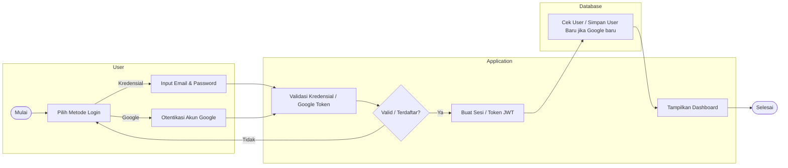

### B. Fitur Pemasukan (Income) - CRUD Lengkap
Menunjukkan seluruh proses penambahan, penayangan, pembaruan, dan penghapusan transaksi pemasukan dana dengan visualisasi swimlane.

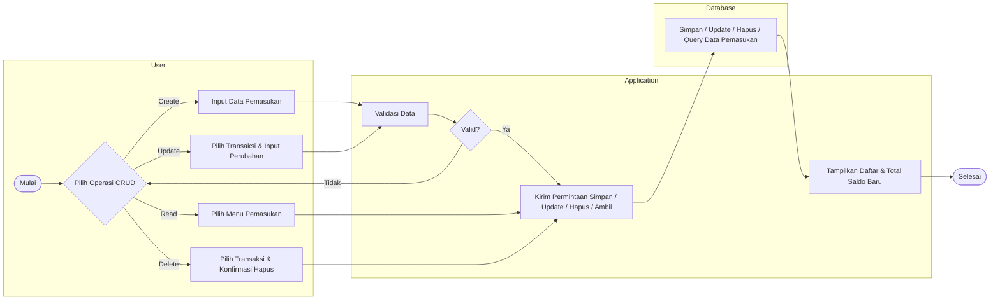

### C. Fitur Pengeluaran (Expense) - CRUD Lengkap
Alur pencatatan, pembaruan, penghapusan, dan visualisasi chart pengeluaran dengan pengecekan batas harian anggaran.

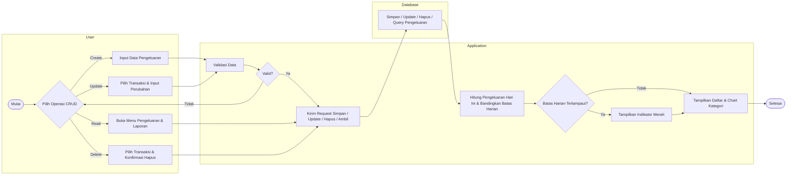

### D. Fitur Batas Harian (Daily Limit)
Alur pemantauan pengeluaran harian terhadap batas anggaran harian yang dikonfigurasi.

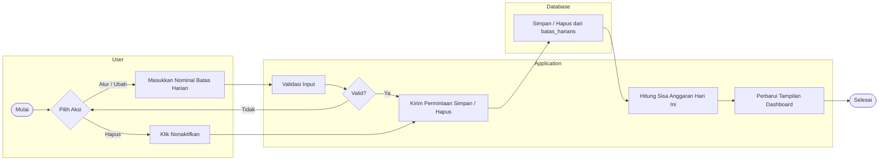

### E. Fitur Tagihan (Bills) - CRUD Lengkap & Pelunasan
Siklus pembuatan tagihan, pengeditan data, pelunasan otomatis (terhubung ke pengeluaran), dan penghapusan tagihan.

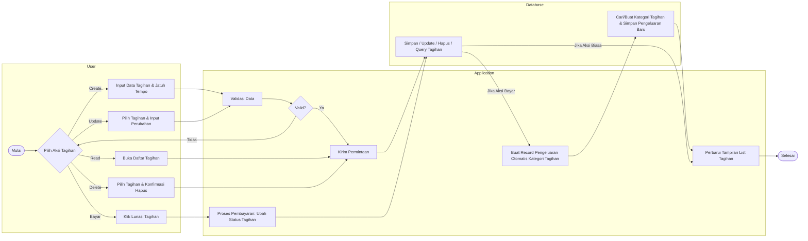

### F. Fitur Pertemanan (Friends) - CRUD-like
Alur pengiriman permintaan teman, penampilan daftar teman aktif/permintaan masuk/keluar, tindakan konfirmasi (terima/tolak), dan penghapusan pertemanan.

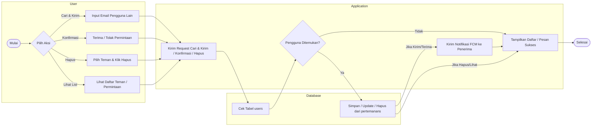

### G. Fitur Hutang (Debt) - CRUD Lengkap & Kolaboratif
Alur pembuatan hutang (manual/kolaboratif), penampilan laporan piutang/hutang saya, proses pembaruan data/status pelunasan, dan penghapusan.

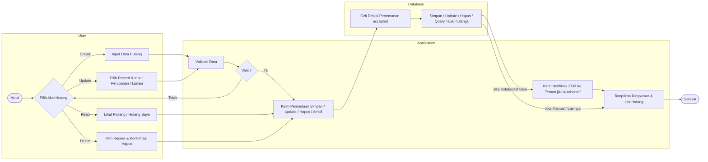

### H. Fitur Notifikasi (Notifications)
Alur perolehan riwayat notifikasi masuk beserta pembacaan pesan.

```mermaid
flowchart LR
    subgraph User["User"]
        direction TB
        Not_Start([Mulai]) --> Not_Action{Pilih Aksi}
        Not_Action -->|Lihat Notifikasi| Not_View[Buka Halaman Notifikasi]
        Not_Action -->|Tandai Dibaca| Not_Read[Klik Notifikasi / Baca Semua]
    end
    
    subgraph Application["Application"]
        direction TB
        Not_Request[Kirim Permintaan Ambil / Baca]
        Not_Display[Tampilkan Notifikasi & Update Badge UI]
    end
    
    subgraph Database["Database"]
        direction TB
        Not_DbExec[Ambil data unread / Update dibaca_at = NOW()]
    end
    
    Not_View --> Not_Request
    Not_Read --> Not_Request
    Not_Request --> Not_DbExec
    Not_DbExec --> Not_Display
    Not_Display --> Not_End([Selesai])
```

---

## 3. Sequence Diagram (Interaksi Komponen per Fitur)

Berikut adalah urutan panggilan pesan (message sequence) antar subsistem/komponen aplikasi untuk tiap-tiap fitur utama menggunakan pendekatan Robustness/MVC (User -> Boundary/View -> Controller -> Entity/Model):

### A. Fitur Autentikasi (Authentication)
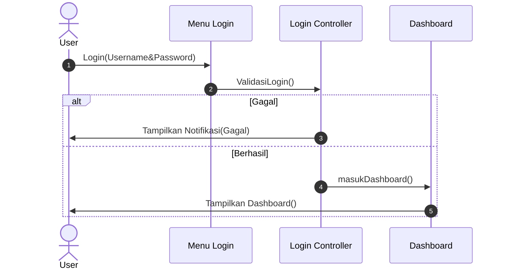

#### Alur Google Sign-In (Mobile Client ke Server)
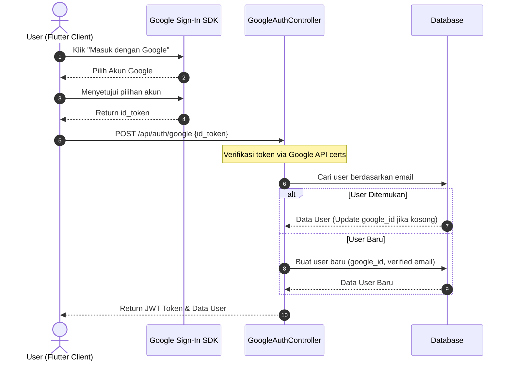


### B. Fitur Pemasukan (Income)
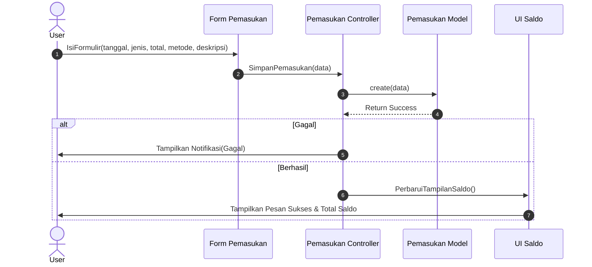

### C. Fitur Pengeluaran (Expense)
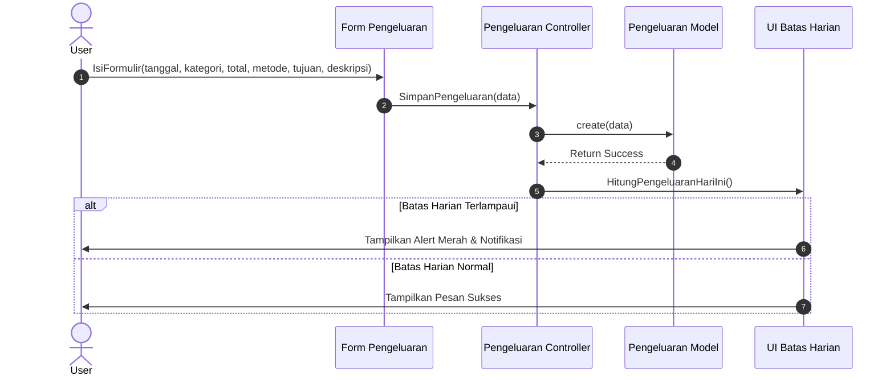

### D. Fitur Batas Harian (Daily Limit)
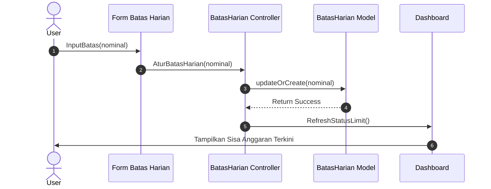

### E. Fitur Tagihan (Bills)
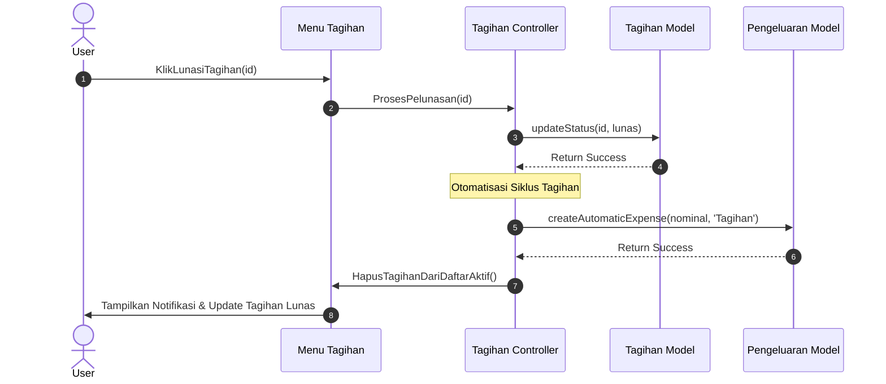

### F. Fitur Pertemanan (Friends)
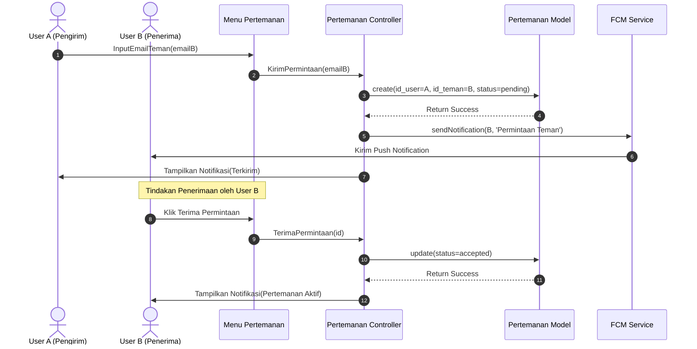

### G. Fitur Hutang & Notifikasi FCM (Debt & FCM)
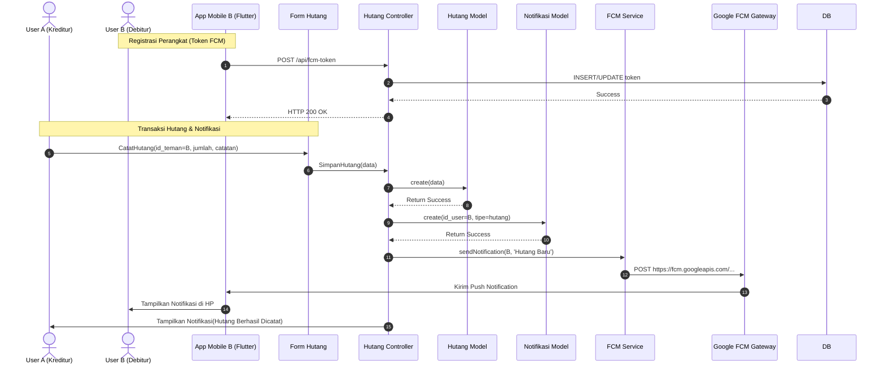

### H. Fitur Notifikasi (Membaca Notifikasi)
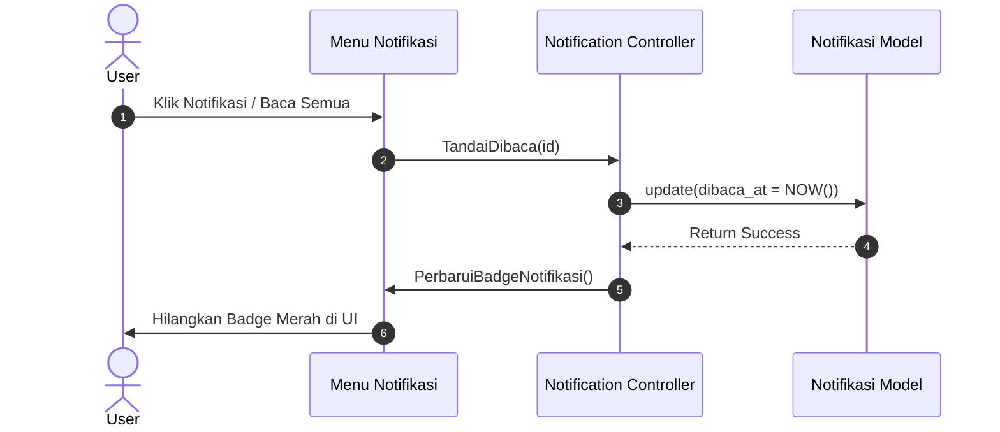

---


## 4. Data Flow Diagram (DFD)

### DFD Level 0 (Context Diagram)
Context diagram menggambarkan aliran data antara entitas luar (Pengguna, Google FCM Gateway, Google OAuth) dengan sistem utama Kelola Uang.

```mermaid
flowchart LR
    %% Entitas
    User["👤 Pengguna (Web & Mobile)"]
    FCM["🔥 Google FCM Gateway"]
    GoogleAuth["🔑 Google OAuth Service"]
    
    %% Sistem
    System(("💻 Platform Kelola Uang<br/>(Backend & API Gateway)"))
    
    %% Aliran Masuk ke Sistem
    User -->|1. Registrasi & Login Kredensial<br/>2. Data Transaksi Pemasukan & Pengeluaran<br/>3. Data Pengaturan Batas Harian<br/>4. Permintaan Teman & Transaksi Hutang<br/>5. FCM Token Perangkat| System
    GoogleAuth -->|Token & Data Profil Google| System
    
    %% Aliran Keluar dari Sistem
    System -->|1. Data Ringkasan Dashboard & Grafik Laporan<br/>2. Riwayat Transaksi & Status Tagihan<br/>3. Status Pertemanan & Hutang-Piutang<br/>4. Daftar Notifikasi Sistem| User
    
    System -->|Payload Notifikasi (FCM Protokol v1)| FCM
    FCM -->|Push Notification Real-time| User
    
    User -->|Login menggunakan Akun Google| GoogleAuth
```

### DFD Level 1 (Diagram Proses)
Membagi sistem menjadi 6 proses utama serta interaksinya dengan data store (tabel-tabel database).

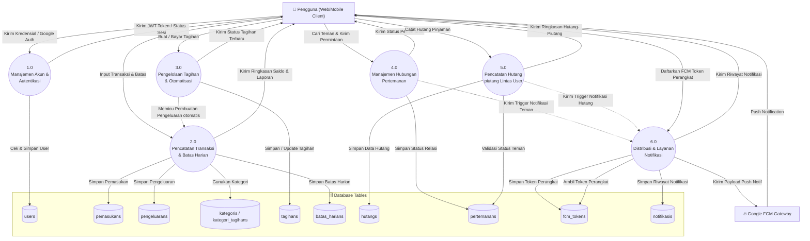

---

## 5. Database Schema Definitions (Definisi Skema Basis Data)

Berikut adalah struktur tabel-tabel database Kelola Uang lengkap dengan tipe data, batasan (constraints), dan keterangan fungsionalnya.

### 1. `users`
Menyimpan data identitas utama akun pengguna untuk autentikasi sistem.
| Nama Kolom | Tipe Data | Key | Nullable | Default | Keterangan |
| :--- | :--- | :---: | :---: | :--- | :--- |
| `id` | bigint unsigned | PK | No | *auto_increment* | ID unik pengguna |
| `name` | varchar(255) | | No | | Nama lengkap pengguna |
| `email` | varchar(255) | Unique | No | | Email unik pengguna (untuk login/cari teman) |
| `email_verified_at`| timestamp | | Yes | NULL | Tanggal verifikasi email |
| `password` | varchar(255) | | No | | Hash sandi pengguna (bcrypt) |
| `google_id` | varchar(255) | | Yes | NULL | ID unik dari Google Sign-In |
| `remember_token` | varchar(100) | | Yes | NULL | Token sesi "remember me" web browser |
| `created_at` | timestamp | | Yes | NULL | Tanggal pembuatan record |
| `updated_at` | timestamp | | Yes | NULL | Tanggal pembaruan record |

### 2. `password_reset_tokens`
Menyimpan token reset kata sandi pengguna.
| Nama Kolom | Tipe Data | Key | Nullable | Default | Keterangan |
| :--- | :--- | :---: | :---: | :--- | :--- |
| `email` | varchar(255) | PK | No | | Email pengguna yang melakukan reset |
| `token` | varchar(255) | | No | | Token acak reset password |
| `created_at` | timestamp | | Yes | NULL | Tanggal pembuatan token |

### 3. `sessions`
Menyimpan data sesi aktif pengguna yang mengakses platform via Web Browser.
| Nama Kolom | Tipe Data | Key | Nullable | Default | Keterangan |
| :--- | :--- | :---: | :---: | :--- | :--- |
| `id` | varchar(255) | PK | No | | ID Sesi unik dari browser |
| `user_id` | bigint unsigned | FK, Index| Yes | NULL | Relasi ke `users.id` |
| `ip_address` | varchar(45) | | Yes | NULL | Alamat IP pengguna |
| `user_agent` | text | | Yes | NULL | Informasi browser / perangkat user |
| `payload` | longtext | | No | | Data serialized dari sesi web |
| `last_activity` | int | Index | No | | Unix timestamp aktivitas terakhir |

### 4. `kategoris`
Menyimpan kategori pengeluaran dinamis yang dibuat dan disesuaikan oleh masing-masing pengguna.
| Nama Kolom | Tipe Data | Key | Nullable | Default | Keterangan |
| :--- | :--- | :---: | :---: | :--- | :--- |
| `id` | bigint unsigned | PK | No | *auto_increment* | ID unik kategori pengeluaran |
| `nama` | varchar(255) | | No | | Nama kategori (misal: "Makanan", "Transportasi") |
| `deskripsi` | varchar(255) | | No | | Keterangan singkat kategori |
| `id_user` | bigint unsigned | FK | No | | Relasi ke `users.id` (Cascade On Delete) |
| `emoji` | varchar(255) | | Yes | NULL | Karakter emoji visual (misal: "🍔", "🚗") |
| `warna` | varchar(255) | | Yes | NULL | Kode warna heksadesimal (misal: "#FF5733") |
| `created_at` | timestamp | | Yes | NULL | Tanggal pembuatan record |
| `updated_at` | timestamp | | Yes | NULL | Tanggal pembaruan record |

### 5. `pengeluarans`
Menyimpan catatan transaksi pengeluaran (arus kas keluar) pengguna.
| Nama Kolom | Tipe Data | Key | Nullable | Default | Keterangan |
| :--- | :--- | :---: | :---: | :--- | :--- |
| `id` | bigint unsigned | PK | No | *auto_increment* | ID unik transaksi pengeluaran |
| `id_user` | bigint unsigned | FK | No | | Relasi ke `users.id` (Cascade On Delete) |
| `id_kategori` | bigint unsigned | FK | No | | Relasi ke `kategoris.id` (Cascade On Delete) |
| `tanggal_pengeluaran`| date | | No | | Tanggal terjadinya pengeluaran |
| `total` | decimal(15,2) | | No | | Nominal uang yang dikeluarkan |
| `description` | text | | No | | Deskripsi detail belanja / pengeluaran |
| `tujuan` | varchar(255) | | Yes | NULL | Nama toko atau penerima pembayaran |
| `metode_pembayaran`| enum | | No | 'Cash' | Pilihan: 'Qris', 'Bank', 'Dana', 'Gopay', 'Cash' |
| `status` | enum | | No | 'draft' | Status pengeluaran: 'draft', 'approved', 'paid' |
| `created_at` | timestamp | | Yes | NULL | Tanggal pembuatan record |
| `updated_at` | timestamp | | Yes | NULL | Tanggal pembaruan record |

### 6. `pemasukans`
Menyimpan catatan transaksi pemasukan (arus kas masuk) pengguna.
| Nama Kolom | Tipe Data | Key | Nullable | Default | Keterangan |
| :--- | :--- | :---: | :---: | :--- | :--- |
| `id` | bigint unsigned | PK | No | *auto_increment* | ID unik transaksi pemasukan |
| `id_user` | bigint unsigned | FK | No | | Relasi ke `users.id` (Cascade On Delete) |
| `tanggal` | date | | No | | Tanggal diterimanya pemasukan |
| `jenis` | enum | | No | 'gaji' | Pilihan: 'gaji', 'bonus', 'penjualan', 'investasi', 'lain-lain' |
| `total` | decimal(15,2) | | No | | Nominal uang masuk |
| `metode_pembayaran`| enum | | No | 'Cash' | Pilihan: 'Qris', 'Bank', 'Dana', 'Gopay', 'Cash' |
| `status` | enum | | No | 'pending' | Status pemasukan: 'pending', 'lunas' |
| `deskripsi` | varchar(255) | | No | | Keterangan singkat pemasukan |
| `created_at` | timestamp | | Yes | NULL | Tanggal pembuatan record |
| `updated_at` | timestamp | | Yes | NULL | Tanggal pembaruan record |

### 7. `kategori_tagihans`
Menyimpan data kategori tagihan dinamis yang dimiliki oleh pengguna.
| Nama Kolom | Tipe Data | Key | Nullable | Default | Keterangan |
| :--- | :--- | :---: | :---: | :--- | :--- |
| `id` | bigint unsigned | PK | No | *auto_increment* | ID unik kategori tagihan |
| `id_user` | bigint unsigned | FK | No | | Relasi ke `users.id` (Cascade On Delete) |
| `nama` | varchar(255) | | No | | Nama kategori tagihan (misal: "Utilitas", "Bulanan") |
| `deskripsi` | varchar(255) | | No | | Penjelasan singkat kategori tagihan |
| `emoji` | varchar(255) | | Yes | NULL | Karakter emoji visual kategori tagihan |
| `warna` | varchar(255) | | Yes | NULL | Kode warna heksadesimal kategori tagihan |
| `created_at` | timestamp | | Yes | NULL | Tanggal pembuatan record |
| `updated_at` | timestamp | | Yes | NULL | Tanggal pembaruan record |

### 8. `tagihans`
Menyimpan kewajiban pembayaran berkala yang wajib dilunasi oleh pengguna.
| Nama Kolom | Tipe Data | Key | Nullable | Default | Keterangan |
| :--- | :--- | :---: | :---: | :--- | :--- |
| `id` | bigint unsigned | PK | No | *auto_increment* | ID unik tagihan |
| `id_user` | bigint unsigned | FK | No | | Relasi ke `users.id` (Cascade On Delete) |
| `kategori` | bigint unsigned | FK | No | | Relasi ke `kategori_tagihans.id` (Cascade On Delete/Update) |
| `nama` | varchar(255) | | No | | Nama tagihan (misal: "Tagihan Listrik PLN") |
| `nominal` | decimal(15,2) | | No | | Jumlah tagihan yang harus dibayar |
| `jatuh_tempo` | date | | No | | Tanggal batas akhir pembayaran |
| `status` | enum | | No | 'belum_dibayar' | Pilihan: 'belum_dibayar', 'lunas', 'terlambat' |
| `metode_pembayaran`| enum | | No | 'Cash' | Pilihan: 'Qris', 'Bank', 'Dana', 'Gopay', 'Cash' |
| `pengulangan` | enum | | No | 'sekali_bayar'| Periode tagihan: 'sekali_bayar', 'bulanan', 'tahunan' |
| `catatan` | varchar(255) | | No | | Catatan tambahan tagihan |
| `created_at` | timestamp | | Yes | NULL | Tanggal pembuatan record |
| `updated_at` | timestamp | | Yes | NULL | Tanggal pembaruan record |

### 9. `batas_harians`
Menyimpan pengaturan batasan pengeluaran harian pengguna.
| Nama Kolom | Tipe Data | Key | Nullable | Default | Keterangan |
| :--- | :--- | :---: | :---: | :--- | :--- |
| `id` | bigint unsigned | PK | No | *auto_increment* | ID unik batas harian |
| `id_user` | bigint unsigned | FK | No | | Relasi ke `users.id` (Cascade On Delete) |
| `batas` | decimal(15,2) | | No | | Jumlah nominal batas pengeluaran harian |
| `created_at` | timestamp | | Yes | NULL | Tanggal pembuatan record |
| `updated_at` | timestamp | | Yes | NULL | Tanggal pembaruan record |

### 10. `hutangs`
Menyimpan transaksi hutang-piutang pengguna (baik kolaboratif dengan teman terdaftar maupun manual).
| Nama Kolom | Tipe Data | Key | Nullable | Default | Keterangan |
| :--- | :--- | :---: | :---: | :--- | :--- |
| `id` | bigint unsigned | PK | No | *auto_increment* | ID unik transaksi hutang |
| `id_user` | bigint unsigned | FK | No | | Kreditur / Pembuat record (Relasi ke `users.id`) |
| `id_teman` | bigint unsigned | FK | Yes | NULL | Debitur terdaftar (Relasi ke `users.id`, Null On Delete)|
| `nama` | varchar(255) | | No | | Nama kontak manual (jika debitur tidak terdaftar) |
| `jumlah` | decimal(15,2) | | No | | Nominal jumlah hutang |
| `tanggal_pinjaman` | date | | No | | Tanggal peminjaman uang |
| `status` | enum | | No | 'belum_lunas' | Pilihan: 'belum_lunas', 'lunas', 'terlambat' |
| `metode_pembayaran`| enum | | No | | Pilihan: 'Qris', 'Bank', 'Dana', 'Gopay', 'Cash' |
| `catatan` | varchar(255) | | Yes | NULL | Keterangan tambahan transaksi hutang |
| `created_at` | timestamp | | Yes | NULL | Tanggal pembuatan record |
| `updated_at` | timestamp | | Yes | NULL | Tanggal pembaruan record |

### 11. `pertemanans`
Menyimpan relasi pertemanan antar dua pengguna terdaftar di sistem.
| Nama Kolom | Tipe Data | Key | Nullable | Default | Keterangan |
| :--- | :--- | :---: | :---: | :--- | :--- |
| `id` | bigint unsigned | PK | No | *auto_increment* | ID unik pertemanan |
| `id_user` | bigint unsigned | FK, Unique| No | | Pengirim permintaan teman (Relasi ke `users.id`) |
| `id_teman` | bigint unsigned | FK, Unique| No | | Penerima permintaan teman (Relasi ke `users.id`) |
| `status` | enum | | No | 'pending' | Status pertemanan: 'pending', 'accepted' |
| `created_at` | timestamp | | Yes | NULL | Tanggal pengiriman permintaan teman |
| `updated_at` | timestamp | | Yes | NULL | Tanggal persetujuan pertemanan |

> [!NOTE]  
> Terdapat indeks unik gabungan (composite unique index) untuk kolom `['id_user', 'id_teman']` untuk mencegah pengiriman permintaan ganda di antara dua pengguna yang sama.

### 12. `fcm_tokens`
Menyimpan Firebase Cloud Messaging (FCM) token perangkat mobile milik pengguna yang aktif.
| Nama Kolom | Tipe Data | Key | Nullable | Default | Keterangan |
| :--- | :--- | :---: | :---: | :--- | :--- |
| `id` | bigint unsigned | PK | No | *auto_increment* | ID unik token perangkat |
| `id_user` | bigint unsigned | FK, Unique| No | | Relasi ke `users.id` (Cascade On Delete) |
| `token` | varchar(255) | Unique | No | | Token unik FCM perangkat dari Firebase SDK |
| `device_name` | varchar(255) | | Yes | NULL | Nama perangkat (misal: "Samsung S24 Ultra", "iPhone 15 Pro") |
| `created_at` | timestamp | | Yes | NULL | Tanggal registrasi token |
| `updated_at` | timestamp | | Yes | NULL | Tanggal pembaruan token |

> [!NOTE]  
> Terdapat indeks unik gabungan `['id_user', 'token']` untuk memastikan satu perangkat hanya terdaftar satu kali untuk setiap akun pengguna.

### 13. `notifikasis`
Menyimpan riwayat notifikasi sistem dan transaksi yang dikirimkan kepada masing-masing pengguna.
| Nama Kolom | Tipe Data | Key | Nullable | Default | Keterangan |
| :--- | :--- | :---: | :---: | :--- | :--- |
| `id` | bigint unsigned | PK | No | *auto_increment* | ID unik notifikasi |
| `id_user` | bigint unsigned | FK, Index| No | | Relasi ke `users.id` (Cascade On Delete) |
| `judul` | varchar(255) | | No | | Judul notifikasi (misal: "Permintaan Pertemanan") |
| `pesan` | text | | No | | Isi deskripsi/pesan notifikasi |
| `tipe` | varchar(255) | | No | | Jenis notifikasi (misal: "pertemanan", "hutang", "sistem")|
| `data` | json | | Yes | NULL | Data payload tambahan dalam format JSON |
| `dibaca_at` | timestamp | Index | Yes | NULL | Tanggal & waktu notifikasi dibaca oleh pengguna |
| `created_at` | timestamp | | Yes | NULL | Tanggal masuknya notifikasi |
| `updated_at` | timestamp | | Yes | NULL | Tanggal perubahan status notifikasi |

> [!NOTE]  
> Terdapat composite index `['id_user', 'dibaca_at']` untuk mempercepat query pencarian notifikasi yang belum dibaca (unread notifications).
