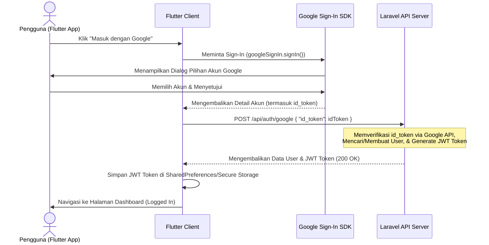

# 🔑 Panduan Integrasi Google Sign-In - Flutter

Panduan lengkap untuk mengimplementasikan login dengan Google menggunakan SDK Flutter dan mengintegrasikannya dengan API backend Laravel Kelola Uang.

---

## 📋 Alur Kerja (Workflow)



---

## 🛠️ Langkah 1: Persiapan & Konfigurasi Google Cloud / Firebase

Sebelum memulai pengkodean di Flutter, Anda harus mengonfigurasi proyek di Google Cloud Console atau Firebase Console untuk mendapatkan kredensial yang diperlukan.

### 🤖 Untuk Android (Google Play Services)
1. Buka **[Firebase Console](https://console.firebase.google.com/)** atau **[Google Cloud Console](https://console.cloud.google.com/)**.
2. Buat proyek baru atau gunakan proyek yang sudah ada.
3. Daftarkan aplikasi Android Anda dengan menyertakan nama paket (package name), contoh: `com.example.kelola_uang`.
4. **PENTING:** Anda harus menambahkan sertifikat **SHA-1 Fingerprint** dari mesin pengembangan Anda (Debug) dan versi rilis (Release).
   - Untuk mendapatkan debug SHA-1 di Windows run command:
     ```powershell
     keytool -list -v -alias androiddebugkey -keystore %USERPROFILE%\.android\debug.keystore
     ```
     *(Password bawaan: `android`)*
5. Unduh file `google-services.json` dan letakkan di direktori:
   `android/app/google-services.json`
6. Tambahkan dependensi classpath Google Services di `android/build.gradle`:
   ```gradle
   dependencies {
       classpath 'com.google.gms:google-services:4.3.15' // atau versi terbaru
   }
   ```
7. Terapkan plugin di `android/app/build.gradle` (di bagian paling bawah file):
   ```gradle
   apply plugin: 'com.google.gms.google-services'
   ```

### 🍎 Untuk iOS
1. Daftarkan aplikasi iOS Anda di Firebase Console dengan Bundle ID Anda (contoh: `com.example.kelolaUang`).
2. Unduh file `GoogleService-Info.plist` dan masukkan ke proyek Xcode Anda di bawah folder `Runner/Runner`.
3. Buka file `ios/Runner/Info.plist` dan tambahkan skema URL khusus untuk menangani callback Google:
   ```xml
   <key>CFBundleURLTypes</key>
   <array>
       <dict>
           <key>CFBundleTypeRole</key>
           <string>Editor</string>
           <key>CFBundleURLSchemes</key>
           <array>
               <!-- Copy REVERSED_CLIENT_ID dari GoogleService-Info.plist -->
               <string>com.googleusercontent.apps.xxxxxxxxxxxx-xxxxxxxxxxxxxxxxxxxxxxxx</string>
           </array>
       </dict>
   </array>
   ```

### 🖥️ Konfigurasi Backend (Laravel)
Pastikan client ID Google Anda telah ditambahkan di berkas `.env` Laravel backend agar backend dapat melakukan validasi token dengan aman:
```env
GOOGLE_CLIENT_ID=xxxxxxxxxxxx-xxxxxxxxxxxxxxxxxxxxxxxx.apps.googleusercontent.com
```

---

## 📦 Langkah 2: Setup Dependency Flutter

Tambahkan dependensi yang diperlukan di berkas `pubspec.yaml` proyek Flutter Anda:

```yaml
dependencies:
  flutter:
    sdk: flutter
  google_sign_in: ^6.2.1
  http: ^1.1.0
  shared_preferences: ^2.2.2
```

Lalu jalankan `flutter pub get` di terminal Anda.

---

## 🔧 Langkah 3: Implementasi Dart Models & Service

### 1. Update Model User
Pastikan kelas model `User` Anda di Flutter mendukung parameter `google_id` dari backend.
Ubah berkas `lib/models/user.dart` (atau model di [02_DART_MODELS.md](file:///c:/Users/ervan/Herd/kelola_uang/docs/docs/flutter/02_DART_MODELS.md#user-model)):

```dart
class User {
  final int id;
  final String name;
  final String email;
  final String? googleId; // Tambahkan ini
  final DateTime? createdAt;
  final DateTime? updatedAt;
  
  User({
    required this.id,
    required this.name,
    required this.email,
    this.googleId,
    this.createdAt,
    this.updatedAt,
  });
  
  factory User.fromJson(Map<String, dynamic> json) {
    return User(
      id: json['id'] as int,
      name: json['name'] as String,
      email: json['email'] as String,
      googleId: json['google_id'] as String?, // Map properti dari JSON
      createdAt: json['created_at'] != null 
          ? DateTime.parse(json['created_at'] as String)
          : null,
      updatedAt: json['updated_at'] != null
          ? DateTime.parse(json['updated_at'] as String)
          : null,
    );
  }
  
  Map<String, dynamic> toJson() {
    return {
      'id': id,
      'name': name,
      'email': email,
      'google_id': googleId,
    };
  }
}
```

### 2. Buat Google Auth Service
Buat berkas service khusus untuk menangani proses autentikasi Google di `lib/services/google_auth_service.dart`:

```dart
import 'dart:convert';
import 'package:google_sign_in/google_sign_in.dart';
import 'package:http/http.dart' as http;
import 'package:shared_preferences/shared_preferences.dart';
import '../models/api_response.dart';
import '../models/user.dart';
import 'api_service.dart';

class GoogleAuthService {
  final ApiService _apiService = ApiService();
  
  // Inisialisasi GoogleSignIn
  // Catatan: scope 'email' dan 'profile' sudah disertakan secara default.
  final GoogleSignIn _googleSignIn = GoogleSignIn(
    scopes: [
      'email',
      'https://www.googleapis.com/auth/userinfo.profile',
    ],
  );

  /// Menjalankan alur login dengan Google
  Future<ApiResponse<Map<String, dynamic>>> loginWithGoogle() async {
    try {
      // 1. Trigger dialog pilihan akun Google di perangkat
      final GoogleSignInAccount? googleUser = await _googleSignIn.signIn();
      
      if (googleUser == null) {
        // Pengguna membatalkan proses sign-in
        throw Exception('Login dibatalkan oleh pengguna.');
      }

      // 2. Ambil detail autentikasi (untuk mendapatkan idToken)
      final GoogleSignInAuthentication googleAuth = await googleUser.authentication;
      final String? idToken = googleAuth.idToken;

      if (idToken == null || idToken.isEmpty) {
        throw Exception('Gagal mendapatkan ID Token dari Google.');
      }

      // 3. Kirim id_token ke backend Laravel
      final response = await _apiService.post(
        '/auth/google', 
        body: {
          'id_token': idToken,
        },
      );

      final jsonResponse = jsonDecode(response.body);

      if (response.statusCode == 200) {
        // 4. Login berhasil, simpan JWT token ke SharedPreferences
        final String token = jsonResponse['data']['access_token'];
        await _apiService.saveToken(token);

        // Mengembalikan respons dengan data JWT & data user
        return ApiResponse.fromJson(
          jsonResponse, 
          (data) => data as Map<String, dynamic>
        );
      } else {
        throw Exception(jsonResponse['msg'] ?? 'Login Google gagal di server.');
      }
    } catch (e) {
      // Pastikan Google Sign-in dalam keadaan ter-disconnect jika terjadi error
      await _googleSignIn.signOut();
      rethrow;
    }
  }

  /// Keluar dari Google dan hapus JWT Token lokal
  Future<void> logoutGoogle() async {
    try {
      // Logout dari Google SDK
      await _googleSignIn.signOut();
      
      // Hapus token JWT lokal melalui base API Service
      await _apiService.deleteToken();
    } catch (e) {
      throw Exception('Gagal logout Google: $e');
    }
  }
}
```

---

## 🎨 Langkah 4: Implementasi UI (Tombol Sign-In Premium)

Berikut adalah contoh implementasi tombol Google Sign-In yang modern dan interaktif menggunakan widget Flutter. Gunakan kode ini di dalam `login_screen.dart` Anda.

```dart
import 'package:flutter/material.dart';
import '../services/google_auth_service.dart';

class LoginScreen extends StatefulWidget {
  const LoginScreen({Key? key}) : super(key: key);

  @override
  State<LoginScreen> createState() => _LoginScreenState();
}

class _LoginScreenState extends State<LoginScreen> {
  final _googleAuthService = GoogleAuthService();
  bool _isGoogleLoading = false;

  Future<void> _handleGoogleLogin() async {
    setState(() => _isGoogleLoading = true);

    try {
      final response = await _googleAuthService.loginWithGoogle();
      
      // Berhasil login
      ScaffoldMessenger.of(context).showSnackBar(
        SnackBar(
          content: Text(response.msg),
          backgroundColor: Colors.green,
        ),
      );

      // Navigasi ke halaman home dashboard aplikasi
      Navigator.pushReplacementNamed(context, '/home');
    } catch (e) {
      // Gagal login
      ScaffoldMessenger.of(context).showSnackBar(
        SnackBar(
          content: Text('Gagal login: ${e.toString()}'),
          backgroundColor: Colors.red,
        ),
      );
    } finally {
      setState(() => _isGoogleLoading = false);
    }
  }

  @override
  Widget build(BuildContext context) {
    return Scaffold(
      backgroundColor: const Color(0xFF121212), // Sleek Dark Theme
      body: Center(
        child: Padding(
          padding: const EdgeInsets.symmetric(horizontal: 24.0),
          child: Column(
            mainAxisAlignment: MainAxisAlignment.center,
            children: [
              // Judul & Subjudul Aplikasi
              const Text(
                'Kelola Uang',
                style: TextStyle(
                  fontSize: 32,
                  fontWeight: FontWeight.bold,
                  color: Colors.white,
                  letterSpacing: 1.5,
                ),
              ),
              const SizedBox(height: 8),
              Text(
                'Catat pengeluaran & tagihan secara otomatis',
                style: TextStyle(
                  fontSize: 14,
                  color: Colors.grey[500],
                ),
                textAlign: TextAlign.center,
              ),
              const SizedBox(height: 48),

              // Form Login Tradisional disini...

              // Pembatas "Atau"
              Row(
                children: [
                  Expanded(child: Divider(color: Colors.grey[800], thickness: 1)),
                  Padding(
                    padding: const EdgeInsets.symmetric(horizontal: 16.0),
                    child: Text(
                      'ATAU',
                      style: TextStyle(color: Colors.grey[600], fontSize: 12),
                    ),
                  ),
                  Expanded(child: Divider(color: Colors.grey[800], thickness: 1)),
                ],
              ),
              const SizedBox(height: 24),

              // Tombol Google Sign-In Modern
              _isGoogleLoading
                  ? const CircularProgressIndicator(color: Colors.white)
                  : SizedBox(
                      width: double.infinity,
                      height: 52,
                      child: OutlinedButton(
                        onPressed: _handleGoogleLogin,
                        style: OutlinedButton.styleFrom(
                          side: BorderSide(color: Colors.grey[800]!),
                          shape: RoundedRectangleBorder(
                            borderRadius: BorderRadius.circular(12),
                          ),
                          backgroundColor: const Color(0xFF1E1E1E),
                          foregroundColor: Colors.white,
                        ),
                        child: Row(
                          mainAxisAlignment: MainAxisAlignment.center,
                          children: [
                            // Custom Painter untuk Menggambar Google Logo berwarna
                            CustomPaint(
                              size: const Size(20, 20),
                              painter: GoogleLogoPainter(),
                            ),
                            const SizedBox(width: 12),
                            const Text(
                              'Masuk dengan Google',
                              style: TextStyle(
                                fontSize: 16,
                                fontWeight: FontWeight.w600,
                              ),
                            ),
                          ],
                        ),
                      ),
                    ),
            ],
          ),
        ),
      ),
    );
  }
}

/// Painter untuk menggambar Logo Google resmi secara vektor
class GoogleLogoPainter extends CustomPainter {
  @override
  void paint(Canvas canvas, Size size) {
    final double w = size.width;
    final double h = size.height;

    final Paint paint = Paint()..style = PaintingStyle.fill;

    // Bagian Merah (Red arc)
    paint.color = const Color(0xFFEA4335);
    final Path redPath = Path()
      ..moveTo(w * 0.5, h * 0.5)
      ..lineTo(w * 0.5, 0)
      ..arcToPoint(
        Offset(w * 0.85, h * 0.15),
        radius: Radius.circular(w * 0.5),
        clockwise: true,
      )
      ..close();
    canvas.drawPath(redPath, paint);

    // Bagian Kuning (Yellow arc)
    paint.color = const Color(0xFFFBBC05);
    final Path yellowPath = Path()
      ..moveTo(w * 0.5, h * 0.5)
      ..lineTo(w * 0.15, h * 0.15)
      ..arcToPoint(
        Offset(w * 0.5, 0),
        radius: Radius.circular(w * 0.5),
        clockwise: true,
      )
      ..close();
    canvas.drawPath(yellowPath, paint);

    // Bagian Hijau (Green arc)
    paint.color = const Color(0xFF34A853);
    final Path greenPath = Path()
      ..moveTo(w * 0.5, h * 0.5)
      ..lineTo(w * 0.5, h)
      ..arcToPoint(
        Offset(w * 0.15, h * 0.15),
        radius: Radius.circular(w * 0.5),
        clockwise: true,
      )
      ..close();
    canvas.drawPath(greenPath, paint);

    // Bagian Biru (Blue arc & bar)
    paint.color = const Color(0xFF4285F4);
    final Path bluePath = Path()
      ..moveTo(w * 0.5, h * 0.5)
      ..lineTo(w * 0.95, h * 0.45)
      ..arcToPoint(
        Offset(w * 0.5, h),
        radius: Radius.circular(w * 0.5),
        clockwise: true,
      )
      ..lineTo(w * 0.5, h * 0.5)
      ..close();
    canvas.drawPath(bluePath, paint);

    // Menutupi bagian dalam agar membentuk huruf G
    paint.color = const Color(0xFF1E1E1E); // Menyamakan dengan background tombol
    canvas.drawCircle(Offset(w * 0.5, h * 0.5), w * 0.3, paint);

    // Menggambar garis horizontal penutup huruf G
    paint.color = const Color(0xFF4285F4);
    final Path gBar = Path()
      ..moveTo(w * 0.5, h * 0.35)
      ..lineTo(w * 0.9, h * 0.35)
      ..lineTo(w * 0.9, h * 0.55)
      ..lineTo(w * 0.5, h * 0.55)
      ..close();
    canvas.drawPath(gBar, paint);
  }

  @override
  bool shouldRepaint(covariant CustomPainter oldDelegate) => false;
}
```

---

> [!TIP]
> **Rekomendasi State Management:**
> Disarankan menggunakan `Provider`, `Riverpod`, atau `flutter_bloc` untuk mengelola state `authStatus` secara global di aplikasi Anda. Anda dapat mendengarkan perubahan status autentikasi untuk secara otomatis mengalihkan pengguna antara halaman Login dan Dashboard Home tanpa memproses logika routing secara manual di view.
